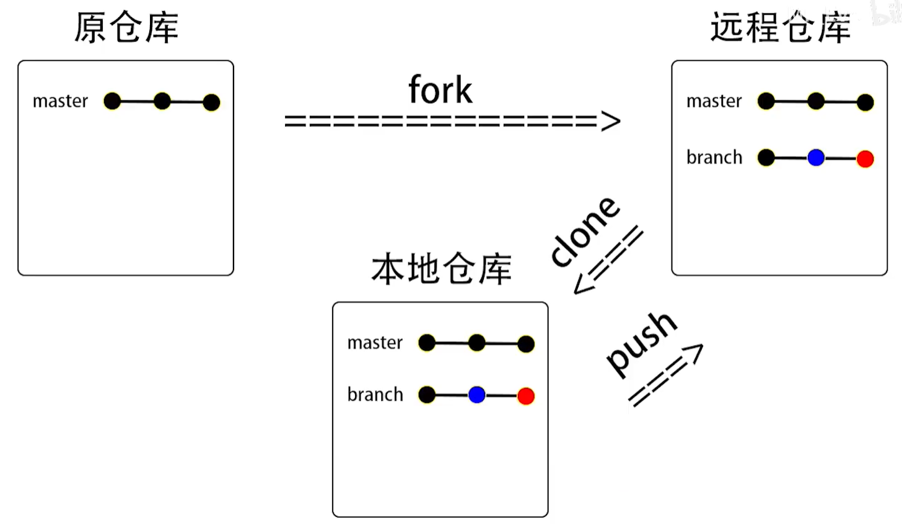

# Git

# 一、Git 基本概念
### 1. Git 历史
Git 是最流行的==分布式版本控制系统==（Distributed Version Control System，简称 DVCS）。
它由 Linus Torvalds 创建，当时非常需要一个快速、高效和大规模分布式的源代码管理系统，用于管理 Linux 源代码。
现在，几乎所有的软件开发，尤其是在开源世界中，都是通过 Git 进行的。

### 2. 版本控制系统
版本控制是指对软件开发过程中各种程序代码、配置文件及说明文档等==文件变更的管理==，是软件配置管理的核心思想之一。
版本控制技术是==团队协作开发==的桥梁，助力于==多人协作同步==进行大型项目开发。
软件版本控制系统的核心任务就是查阅项目历史操作记录、实现==协同开发==。
常见版本控制主要有两种：==集中式版本控制==和==分布式版本控制==。

### 集中式版本控制系统
集中式版本控制系统，版本库是集中存放在中央服务器的。
工作时，每个人都要先从中央服务器获取最新的版本。
完成之后，再把自己添加/修改的内容提交到中央服务器。所有文件和历史数据都存储在中央服务器上。`SVN` 是==最流行的集中式==版本控制系统之一。

##### 缺点
- ==必须联网==才能使用，如果使用`局域网`还好，速度会比较快。
而如果是使用`互联网，网速慢`的话，就可能需要等待很长时间。
- 如果中央服务器出现故障，那么版本控制将不可用。
- 如果中心数据库损坏，若数据未备份，数据就会丢失。


## clone 克隆仓库
- 将远程仓库下载到本地
```js
git clone <repositoryUrl>
```

## init 初始化git (initialization)
- 初始化git环境, 生成相关的配置文件
```js
git init [<myproject>]
```


## config 配置环境 (configure)
- 配置环境config
- 还有两个必要的设置
```js
git config --global user.name <userName>

git config --global user.email <userEmail>
```


## add 加入暂存区
- 把文件加入暂存区(`index` / `stage`), 让文件变绿; (绿 : Staged)
即 可提交
```js
//加入单个文件
git add <filename>
//加入全部文件 和全部非空文件夹
git add .
```
暂存区在版本管理工具中并不是必须的, SVN中就没有暂存区, 直接把源代码提交到仓库

## reset 加入暂存区
- 防止文件提交变更, 让文件变红; (红 : Modified / Untracked)
即 不可提交
```js
//移除单个文件提交变更
git reset <filename>
```
- 将现有文件 恢复到历史提交状态
且将在 `log` 中忽略此提交的往后提交
--hard:不保存所有变更
--soft:保留变更且变更内容处于 Staged
--mixed:保留变更且变更内容处于 Modified (默认)
```js
//将现有文件恢复到当时提交
git reset <commitID> (前7位哈希值就可以锁定ID)
```

## commit 提交变更
- 提交变更到仓库
commit只提交add过的文件
```js
git commit -m <message>
```
- `-m` 指 message
- `<message>` 指描述 / 备注 (字符串)

git会把源代码==以数据库的形式==保存在仓库中
提交应当是完整的功能代码


## log / reflog 查看提交日志
```js
git log (提交历史记录)
git reflog (历史所有提交)
```

## status 文件状态
#### - Untracked  新建的文件;
#### - Staged  已暂存的文件;(add过的) (未commit)
#### - Modified  有修改的 / 未提交的 
#### - Unmodified  未修改的 / 已提交的 (已commit)


## alias 别名
可以到 config 文件中修改 (.git中)

## branch 分支
- 查看所有分支
```js
git branch
```
- 创建的新分支包括模板的所有历史提交
```js
git branch -b <new_branch> <template>
```
`<new_branch> ` :新分支名字

`<template>`:复制模板 (默认为当前分支)
- 切换分支1
```js
git checkout <branchName>
```
- 切换分支2
```js
git switch <branchName>
```

- 切换到远程仓库的分支
```js
git checkout -b <branchName> origin <template>
例 : 
git checkout -b test_for_me origin test
```

## merge 合并
- 合并变更
```js
git merge <branchName>
```
当合并出现冲突时
- 可以手动删除保留代码 解决冲突
- 也可以用vs code 的按钮 解决冲突


# remote 远程仓库
- 作为中央仓库来管理所有的分支


## push 推送提交
在远端仓库设置一个与本地链接的上行分支
```js
git push -set-upstream origin bc-a
```
`-set-upstream` :设置为对应上流分支
`origin` :远端仓库

- 有上行分支才能直接push
```js
git push
```

## fetch 远程抓取
```js
git fetch
```

## pull 远程拉取
- 如果你想更新你远程分支同步来的分支 可以 `pull`
将上行分支变更的部分合并到本地分支
相当于 fetch 后, 自动 merge
```js
git pull
```

## rebase 变基
- 如果要跟新本地的远程分支, 又要修正 commit 的正确顺序, 即主分支在前.
重新排列本地和远程的 commit 在本地
```js
git rebase
git rebase --continue (分支有冲突)
```


# Github

## fork
将这个项目插到自己的仓库里

## PR pull request


### 为项目贡献代码

先 fork 该项目到自己的仓库
然后 clone 到 本地
修改代码 然后 commit 新的提交
push 回到自己的仓库
最后发起 PR 
在其中填写比对(compare)的分支
github 会将两个分支之间不同的变更单独拿出来作为一个 PR
(PR 是对比分支间不同的 commit)
如果有需要修改的,可以直接 push 修改代码的 commit 不用了再PR了

