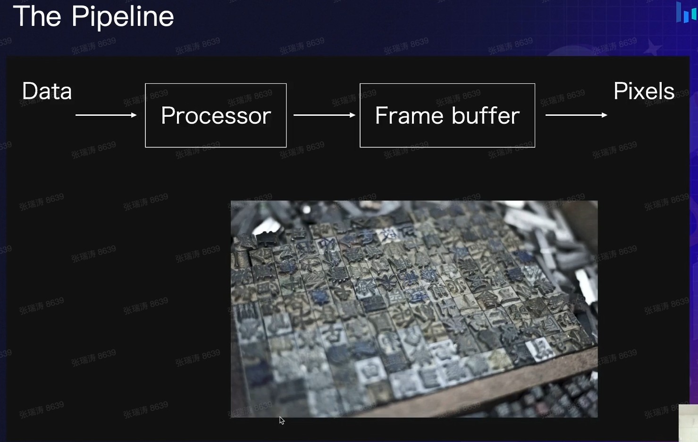
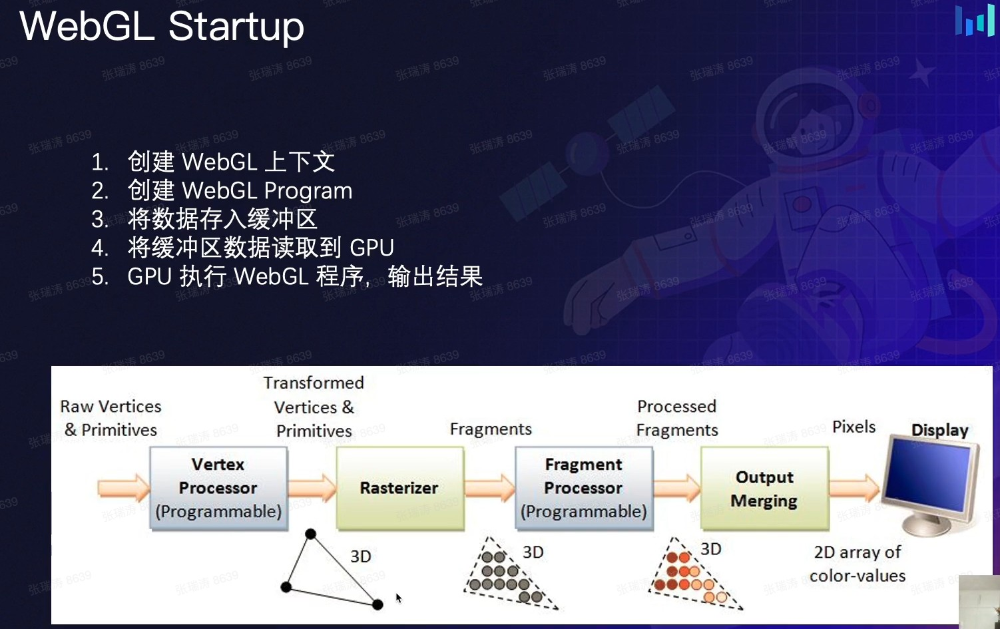
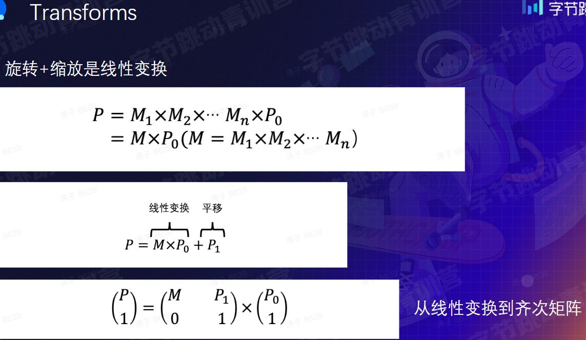
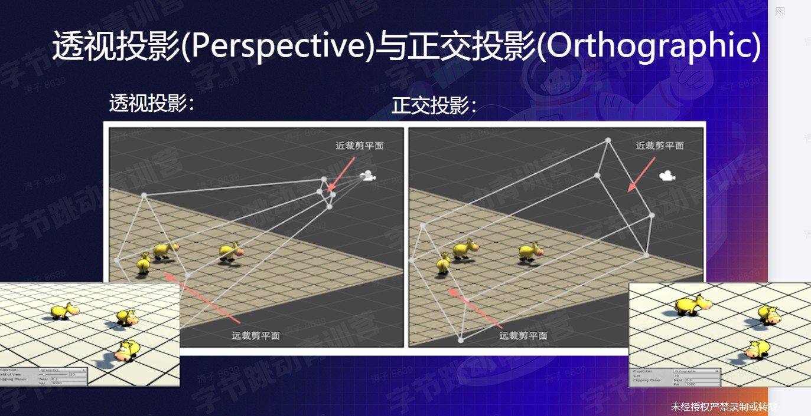
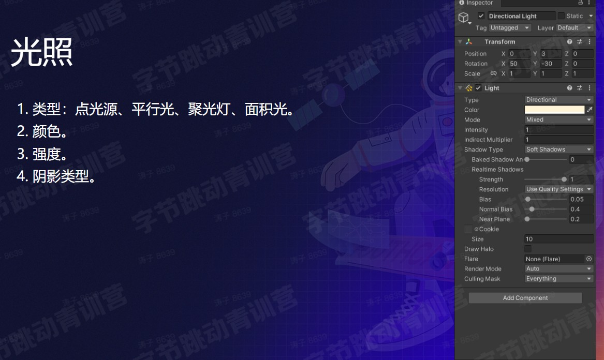
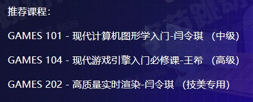

# 前端 3D

## webGL

- 光栅(Raster):
  - 几乎所有的现代图形系统都是基于光栅来绘制图形的，光栅就是指构成图像的像素阵列
- 像素(Px):
  - 一个像素对应图像上的一个点，它通常保存图像上的某个具体位置的颜色等信息。
- 帧缓存(Frame Buffer):
  - 在绘图过程中，像素信息被存放于帧缓存中，帧缓存是一块内存地址。
- CPU(Central Processing Unit):
  - 中央处理单元，负责逻辑计算。
- GPU(Graphics Processing Unit):
  - 图形处理单元，负责图形计算。




## CPU vS GPU

`CPU`
可以计算复杂逻辑，相当于一个大管道，处理量小

`GPU`
大量的计算小单元，相对简单大量的图形计算，用 GPU 更有优势


`WebGL属于OpenGL`

## webGL 基础



1. 创建 WebGL 上下文
2. 创建 WebGL Program
3. 将数据存入缓冲区
4. 将缓冲区数据读取到 GPU
5. GPU 执行 WebGL 程序，输出结果

`着色器语言 GLSL (opengl-shader-language）`

创建 WebGL 上下文 canvas

```js
const gl = canvas.getContext('webgl') //获取webGL的上下文
```

两级着色器

1. 顶点着色器：处理图形顶点
2. 片段着色器：处理顶点和图元定义的区域内像素点

### 齐次矩阵



# Read More

1. [The book of shaders](https://thebookofshaders.com/)
2. [Mesh.js](https://github.com/mesh-js/mesh.js)
3. [glsl-doodle](https://doodle.webgl.group/)
4. [SpriteJS](http://spritejs.com/#/)
5. [ThreeJS](https://threejs.org/)
6. [ShaderToy](https://www.shadertoy.com/)
7. [稀土掘金 充分理解 WebGL](https://juejin.cn/column/7100864898279669767)

# 3D 游戏


# 3D 实体


# 相机


### 透视投影和正交投影





# 控制与碰撞


https://docs.unity3d.com/Manual/ExecutionOrder.html


# 知识点总结


# Read More


