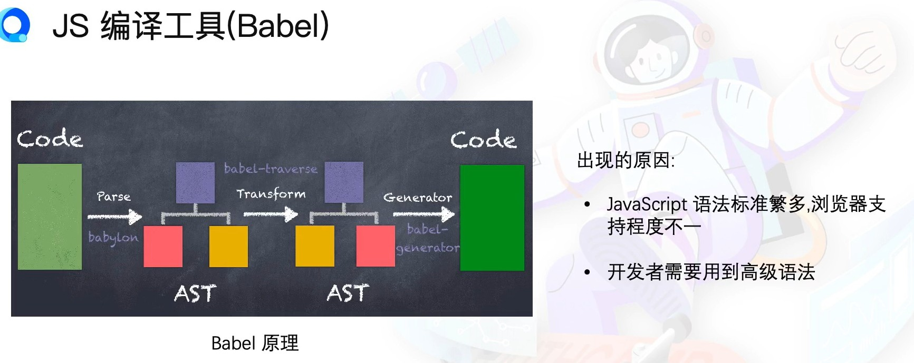
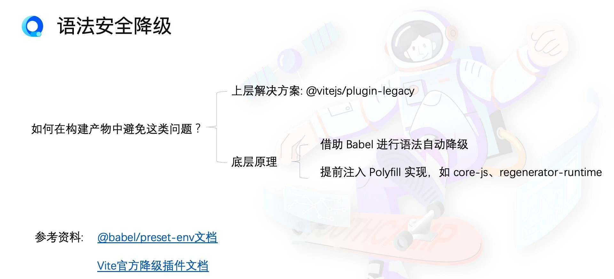
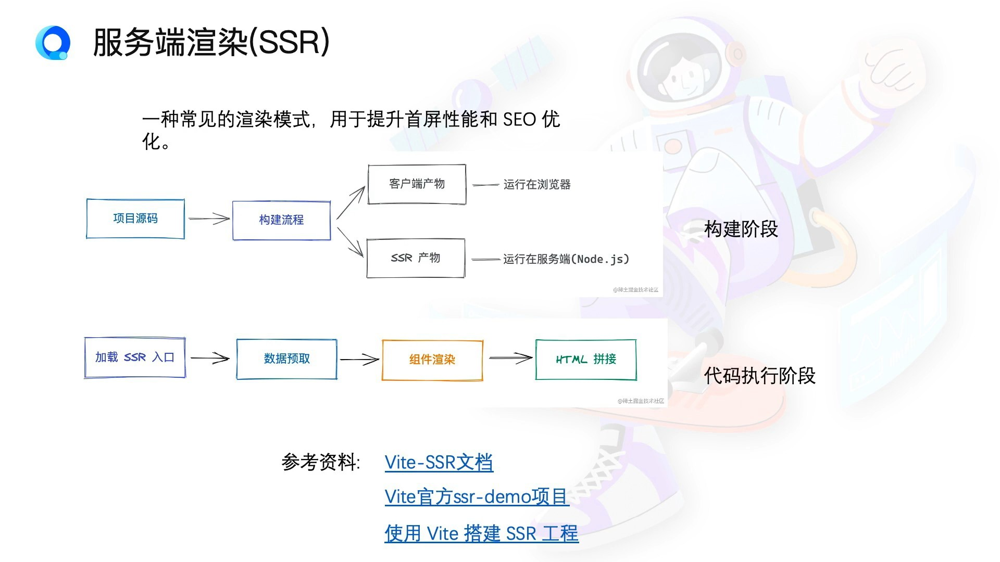

# 工程化

### 前端构建工具解决的问题
- 模块化 （模块加载）
- 资源编译（高级语言语法转译 ts、sass；资源加载）
- 产物质量（lint、prettier、压缩、语法降级）
- 开发效率（HMR热更新）

#### `Vite`
开发时：no-bundle，无需打包，按需加载
构建时：给予Rollup的Bundler

`构建工具历史问题:`
- 启动慢，热更新慢
- bundle带来的性能开销
- JS的性能瓶颈

`新一代构建工具`
1. 原生 ESM 模块化被浏览器大范围支持
- vite 基于原生ESM的开发服务优势
  - 无需打包源代码
  - 天然按需加载
  - 利用文件级的浏览器缓存

2. 原生语言编写的前端构建工具
- rust写的SWC
- go写的esbuild
  - esbuild三大功能
    1. 打包器 Bundler 对标 webpack
    2. 编译器 Transformer 对标 Babel
    3. 压缩器 Minifier 对标 tersor/uglify

*vite 底层依赖 rollup 和 esbuild 双引擎*

vite插件机制
- 解耦 dev server 和 构建相关能力
- 易扩展,社区提供插件

#### vite Hooks

#### Rollup的代码分割
`好处`
- 浏览器可以并发请求资源
- 缓存复用率高
- HMR可以更新部分模块

#### Babel
- 开发这要享受语法升级的便利
- 同时要兼容浏览器的支持程度

#### 服务端渲染(SSR)
node先拿到服务端的数据来构建HTML,把完整的页面给到前端。

