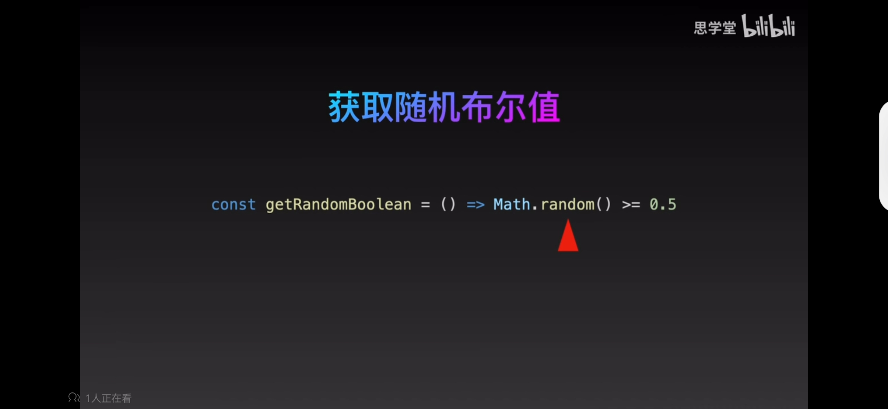
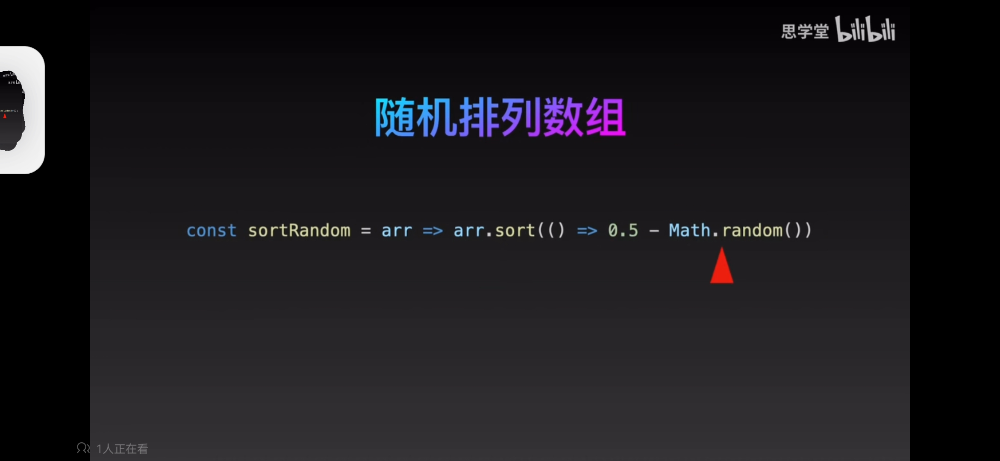

# 工具函数

### 防抖

```js
function thro(fn, delay = 100) {
  let timer = null
  return function () {
    if (timer) clearTimeout(timer)
    timer = setTimeout(() => {
      fn.apply(this, arguments)
      let timer = null
    }, delay)
  }
}
```

### 节流

```js
function throttle(fn, gap = 100) {
  let timer = null
  return function () {
    if (timer) return
    timer = setTimeout(() => {
      fn.apply(this, arguments)
      let timer = null
    }, gap)
  }
}
```

# 正则

### 匹配国内电话

```js
const Regex = /^(?:\+86)?1[0-3,5-9]{2}[0-9]{8}$/
```

# 数组

### 数组降维

```js
function deepFlattenArr(arr) {
  return [].concat(...arr.map(v => (Array.isArray(v) ? deepFlattenArr(v) : v)))
}
```


# 数字

## 数字格式化

### 数字千分位格式

```js
const toDecimal = num => num.toLocaleString()
// or
const toDecimal = num => [num].toLocaleString()
```


### 随机布尔值

```js
const getRandomBoolean = () => Math.random() >= 0.5
```



### 随机排列数组

```js
const sortRandom = arr => arr.sort(() => 0.5 - Math.random())
```



### 数组交集 filter

```js
const intersection = (arr, brr) => arr.filter(v => brr.includes(v))
```


