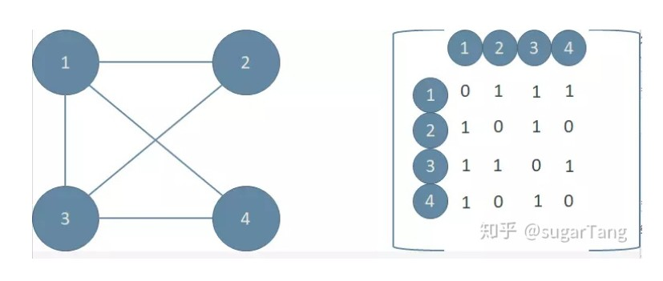
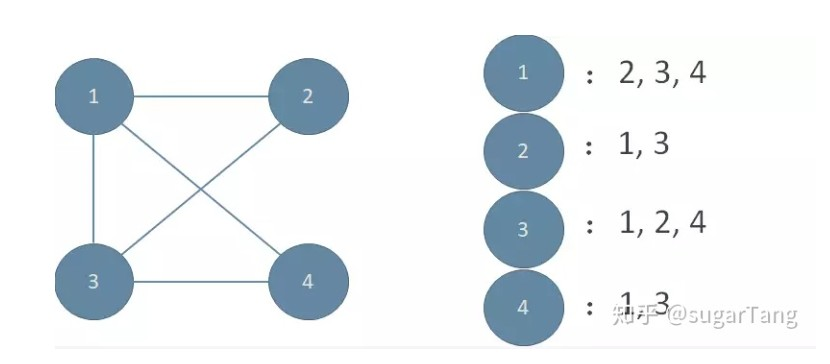

# 数据结构与算法

## 搜索算法

->搜索算法是属于一种比较基础的算法，相当于万丈高楼的第一层，也是后期学习的一些高级算法的基础部分,搜索算法分为深度优先搜索（ Depth First Search , DFS）和广度优先搜索（Breadth First Search, BFS）这两种。

### 深度优先搜索（Depth First Search , DFS）
先走到最深然后再返回上一个节点走到最深，直到遍历完整棵树

DFS 一般我们可以用递归实现，如果采用[邻接矩阵](#邻接矩阵)
最后一点，就是 DFS 运用的不同的场景限制会有些不同，有些时候需要去掉重复的路径，还有的是预防存在环路，代码死循环，或者没有找完的情况。

### 广度优先搜索（Breadth First Search, BFS）
一层一层遍历，所以会更快到达目标

#`TODO:`

### 邻接矩阵

->邻接矩阵是说我们用一个二维矩阵 A 来表示边集。Aij=0 表示顶点 i 和顶点 j 之间不存在边，Aij=1 表示顶点 i 和顶点 j 之间存在边。如果我们用邻接矩阵表示上图，是这个样子:

在程序中，我们一般用一个二维数组来表示邻接矩阵: int a[N+1][n+1]。a[i][j]==1 表示 i 和 j 之间有边相连，a[i][j]==0 表示 i 和 j 之间没有边相连。

### 邻接表

->邻接矩阵是说我们用一个二维矩阵 A 来表示边集。Aij=0 表示顶点 i 和顶点 j 之间不存在边，Aij=1 表示顶点 i 和顶点 j 之间存在边。如果我们用邻接矩阵表示上图，是这个样子:

在程序中，我们一般用一个二维数组来表示邻接矩阵: int a[N+1][n+1]。a[i][j]==1 表示 i 和 j 之间有边相连，a[i][j]==0 表示 i 和 j 之间没有边相连。

### 动态规划 & 贪心算法
他们都是寻求最优解，区别是：
- 动态规划是全局最优解，把所有计算结果保存，比对得出最优解。
- 贪心算法是阶段最优解，只要当前情况的最优结果，最后的出一条相对最优解。

如果一个问题在数学中用贪心算法有最优解，那么贪心算法就能更快