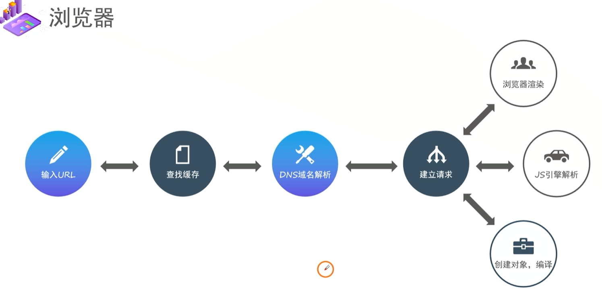
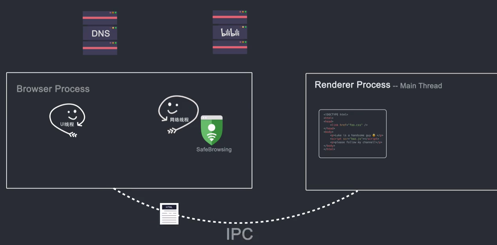
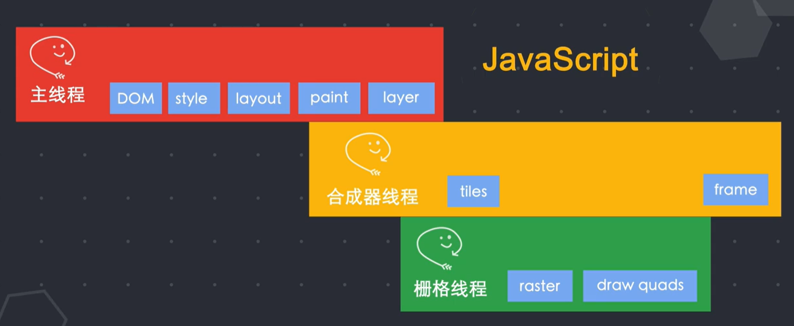
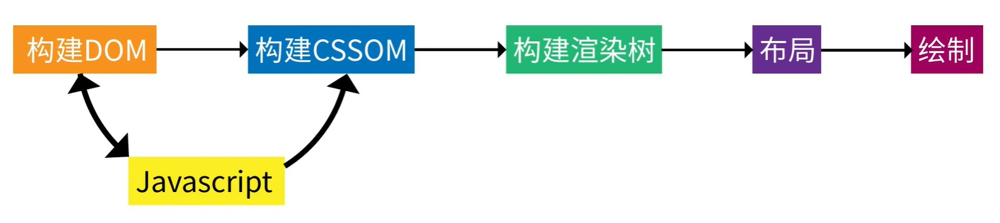
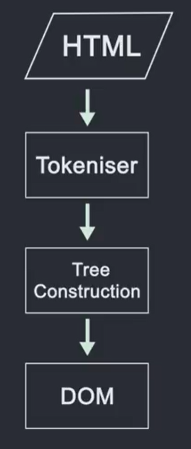
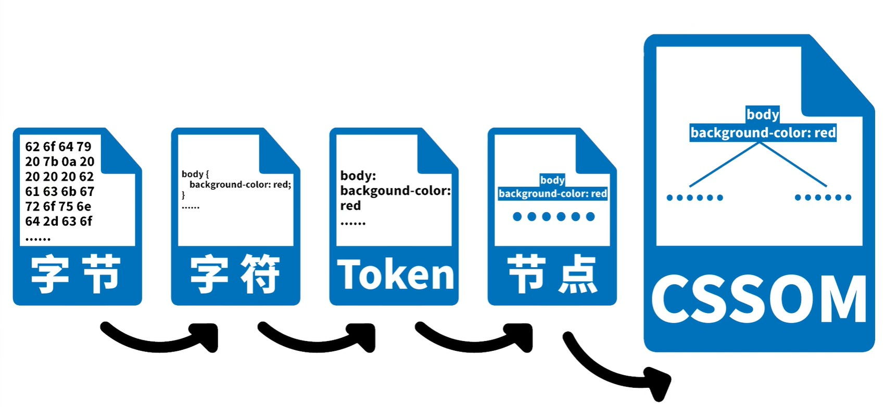
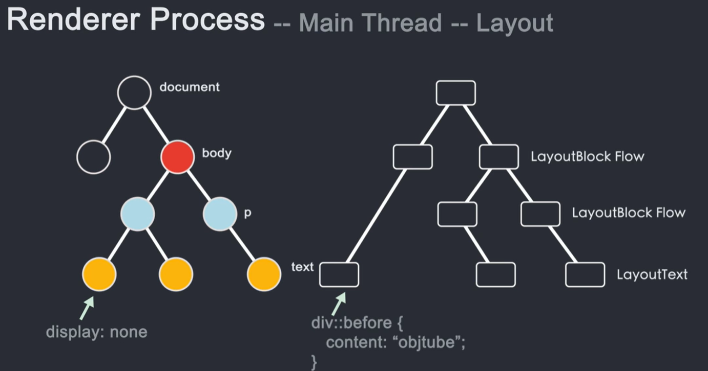
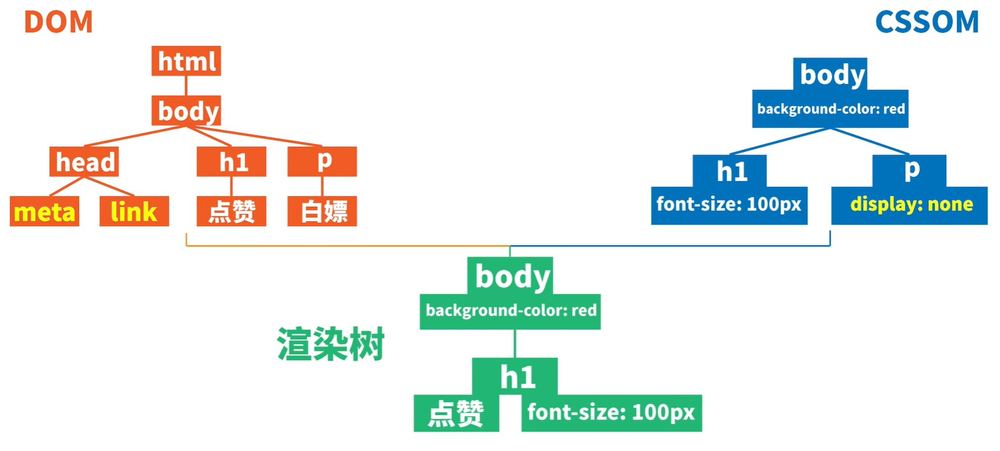

# 浏览器工作原理

#### 前端八股文

# 浏览器工作流程

## 浏览器进程

浏览器进程中的UI线程检测到URL输入会请求网络线程(->DNS->目标服务器)获取==资源==

网络线程 通过安全校验后将获取到的==资源==传回UI线程

UI线程 会创建一个渲染器进程(Render Process)来渲染页面

浏览器进程 通过IPC管道将数据传递给==渲染器进程== (不同进程通过==IPC管道==进行数据交换)

收到渲染器进程传来的合成器帧(Frame)

接着浏览器进程将合成器帧传送到GPU,然后GPU渲染展示到屏幕上

## 浏览器渲染引擎

浏览器渲染：客户端（浏览器）解析HTML内容并渲染出来，浏览器接收到数据包后的解析流程为：

### 主线程(Main Thread)

1.  构建 D0M树 ：词法分析然后解析成D0M树,是由dom元素及属性节点组成，树的根是document对象 `(可部分解析)`
2.  构建 CSS规则树 ：生成CSS规则树(CSS Rule Tree) `(不可部分解析)`
3.  构建 render树 ：Web浏览器将D0M和CSS0M结合，并构建出渲染树(render tree)
4.  布局 (Layout) ：计算出每个节点在屏幕中的位置
5.  绘制 (Painting) ：即遍历render树，并使用UI后端层绘制每个节点。(绘制顺序)
6.  生成layer树

>外联JS文件会阻塞会阻塞HTML解析
>JS会阻塞渲染, 可以操作DOM和CSSOM来阻塞渲染

1.   渲染器中的主线程会==解析HTML==, 构造DOM数据结构 (是浏览器对页面在其内部的表示形式,是JS能与浏览器交互的数据结构和API)

-   其中,html经过tokeniser标记化,通过词法分析将输入的HTML内容解析成多个标记

-   根据识别后的标记进行DOM树构造 (以documentl的为根节点的DOM树)

-   因为JS也同样占用主线程,所以解析HTML的`<script>`时会转而解析JS,停止继续解析HTML文档

-   所以script需要异步加载JS(async/defer)

2.   主线程会进而==解析CSS==,从而确定每个DOM节点的计算样式

3.   主线程通过遍历DOM树和计算好的样式来==生成layout树==

-   因为是通过style样式之后生成的layout树,所以此时才会新增伪元素

-   display:none的内容,存在于DOM,但是不会在layout树中,所以自然会影响重排

4.   主线程通过遍历layout树,确定一个绘制记录表(paint record),确定绘制顺序
5.   主线程通过遍历layout树,生成layer树

主线程将layer树和绘制顺序(paint)传递给==合成器线程==

### 合成器线程(Compositor Thread)

1.  栅格化(rastering)在合成器线程(不在主线程)将每个图层栅格化,进而切分为图块(tiles)传递给栅格线程

3.   图块栅格化后, 合成器线程将收集称为“draw quads"的图块信息(记录了图块在内存中的位置,页面的哪个位置绘制图块的信息)
4.   根据这些信息,生成一个合成器帧(Compositor Frame)->==传送回浏览器进程==

### 栅格线程(Raster Thread)

2.   栅格线程栅格化每个图块,进而存储到GPU内存中,

#### tips

JS会占用主线程,所以可能会影响页面渲染,影响用户体验.

但是transform不会占用主线程,只改变合成线程,自然也不会和JS抢占资源,也不会重排和重绘.

## 重绘、重排、合成

#### 重排

-   当DOM的变化影响了元素的几何信息，浏览器需要重新计算元素的几何属性，将其安放在界面中的正确位置，这个过程叫做重排。表现为重新生成布局，重新排列元素。

#### 重绘

-   当一个元素的外观发生改变，但没有改变布局，重新把元素外观绘制出来的过程，叫做重绘。表现为某些元素的外观被改变。

-   当css的非几何属性更改,不需要重新经过布局和分层阶段,开销较小

#### 重绘时不一定会重排

#### 重排一定会引起重绘

#### 合成

-   合成是不使用主线程的动画绘制，避开了布局和绘制两个子阶段，相较于前两个大大提升了绘制效率

尽量少使用display：none，会造成重排，==用visibility：hidden来替代==，后者只会造成重绘

每一次设置行内style样式的话，都会触发一次reflow，==使用class代替==

尽量==少使用table布局==，table中某个元素一旦触发了reflow，整个table的元素都会触发reflow

可以用transform就用，因为transform可以开启硬件加速，可以规避重排和重绘，走合成进程

## 浏览器JS引擎

#### 创建Window对象

vindow对象也叫全局执行环境，当页面产生时就被创建，所有的全局变量和函数都属于vindow的属性和方法，而DOM Tree也会映射在window的doucment对象上。当关闭网页或者关闭浏览器时，全局执行环境会被销毁。

#### 加载文件

完成jS引擎分析它的语法与词法是否合法，如果合法进入预编译

#### 预编译

在预编译的过程中，浏览器会寻找全局变量声明，把它作为window的属性加入到windowi对象中，并给变量赋值为'undefined;寻找全局函数声明，把它作为window的方法加入到windowi对象中，并将函数体赋值给他（匿名函数是不参与预编译的，因为它是变量）。而变量提升作为不合理的地方在ES6中已经解决了，函数提升还存在。

#### 数据分析

执行到变量就赋值，如果变量没有被定义，也就没有被预编译直接赋值string、int这样的值就是直接把值放在变量的存储空间里，obiect对象就是把指针指向变量的存储空间。函数执行，就函数的环境推入一个环境的栈中，执行完成后再弹出，控制权交还给之前的环境。JS作用域其实就是这样的执行流机制实现的。

# 页面渲染方案

### SSR (Server Side Render) 服务端渲染

### SSG (Static Site Generation) 静态站点生成