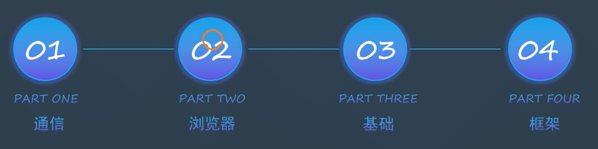

# 浏览器工作原理

#### 前端八股文

# 浏览器工作流程

## 浏览器进程

浏览器进程中的 UI 线程检测到 URL 输入会请求网络线程(->DNS->目标服务器)获取==资源==

网络线程 通过安全校验后将获取到的==资源==传回 UI 线程

UI 线程 会创建一个渲染器进程(Render Process)来渲染页面

浏览器进程 通过 IPC 管道将数据传递给==渲染器进程== (不同进程通过==IPC 管道==进行数据交换)

收到渲染器进程传来的合成器帧(Frame)

接着浏览器进程将合成器帧传送到 GPU,然后 GPU 渲染展示到屏幕上

## 浏览器渲染引擎

浏览器渲染：客户端（浏览器）解析 HTML 内容并渲染出来，浏览器接收到数据包后的解析流程为：

### 主线程(Main Thread)

1.  构建 D0M 树 ：词法分析然后解析成 D0M 树,是由 dom 元素及属性节点组成，树的根是 document 对象 `(可部分解析)`
2.  构建 CSS 规则树 ：生成 CSS 规则树(CSS Rule Tree) `(不可部分解析)`
3.  构建 render 树 ：Web 浏览器将 D0M 和 CSS0M 结合，并构建出渲染树(render tree)
4.  布局 (Layout) ：计算出每个节点在屏幕中的位置
5.  绘制 (Painting) ：即遍历 render 树，并使用 UI 后端层绘制每个节点。(绘制顺序)
6.  生成 layer 树

> 外联 JS 文件会阻塞会阻塞 HTML 解析
> JS 会阻塞渲染, 可以操作 DOM 和 CSSOM 来阻塞渲染

1.  渲染器中的主线程会==解析 HTML==, 构造 DOM 数据结构 (是浏览器对页面在其内部的表示形式,是 JS 能与浏览器交互的数据结构和 API)

- 其中,html 经过 tokeniser 标记化,通过词法分析将输入的 HTML 内容解析成多个标记

- 根据识别后的标记进行 DOM 树构造 (以 documentl 的为根节点的 DOM 树)

- 因为 JS 也同样占用主线程,所以解析 HTML 的`<script>`时会转而解析 JS,停止继续解析 HTML 文档

- 所以 script 需要异步加载 JS(async/defer)

2.  主线程会进而==解析 CSS==,从而确定每个 DOM 节点的计算样式

3.  主线程通过遍历 DOM 树和计算好的样式来==生成 layout 树==

- 因为是通过 style 样式之后生成的 layout 树,所以此时才会新增伪元素

- display:none 的内容,存在于 DOM,但是不会在 layout 树中,所以自然会影响重排

4.  主线程通过遍历 layout 树,确定一个绘制记录表(paint record),确定绘制顺序
5.  主线程通过遍历 layout 树,生成 layer 树

主线程将 layer 树和绘制顺序(paint)传递给==合成器线程==

### 合成器线程(Compositor Thread)

1.  栅格化(rastering)在合成器线程(不在主线程)将每个图层栅格化,进而切分为图块(tiles)传递给栅格线程

2.  图块栅格化后, 合成器线程将收集称为“draw quads"的图块信息(记录了图块在内存中的位置,页面的哪个位置绘制图块的信息)
3.  根据这些信息,生成一个合成器帧(Compositor Frame)->==传送回浏览器进程==

### 栅格线程(Raster Thread)

2.  栅格线程栅格化每个图块,进而存储到 GPU 内存中,

#### tips

JS 会占用主线程,所以可能会影响页面渲染,影响用户体验.

但是 transform 不会占用主线程,只改变合成线程,自然也不会和 JS 抢占资源,也不会重排和重绘.

## 重排、重绘、合成

#### 重排

- 当 DOM 的变化影响了元素的几何信息，浏览器需要重新计算元素的几何属性，将其安放在界面中的正确位置，这个过程叫做重排。表现为重新生成布局，重新排列元素。

#### 重绘

- 当一个元素的外观发生改变，但没有改变布局，重新把元素外观绘制出来的过程，叫做重绘。表现为某些元素的外观被改变。

- 当 css 的非几何属性更改,不需要重新经过布局和分层阶段,开销较小

#### 重绘时不一定会重排

#### 重排一定会引起重绘

####　浏览器本身也有优化策略
- 对于重排重绘，浏览器本身也有优化策略，浏览器会维护一个队列，将重排重绘操作放入队列中，等队列到达一定时间，再按顺序去一次性执行队列的操作。

- 但是也有例外，有时我们需要获取某些样式信息，例如：
  offsetTop，offsetLeft，offsetWidth，offsetHeight，scrollTop/Left/Width/Height，clientTop/Left/Width/Height，getComputedStyle()，或者 IE 的 currentStyle。

- 这时，浏览器为了反馈准确的信息，需要立即重排重绘一次，所以可能导致队列提前执行

#### 合成

- 合成是不使用主线程的动画绘制，避开了布局和绘制两个子阶段，相较于前两个大大提升了绘制效率

尽量少使用 display：none，会造成重排，==用 visibility：hidden 来替代==，后者只会造成重绘

每一次设置行内 style 样式的话，都会触发一次 reflow，==使用 class 代替==

尽量==少使用 table 布局==，table 中某个元素一旦触发了 reflow，整个 table 的元素都会触发 reflow

可以用 transform 就用，因为 transform 可以开启硬件加速，可以规避重排和重绘，走合成进程

## 浏览器 JS 引擎

#### 创建 Window 对象

vindow 对象也叫全局执行环境，当页面产生时就被创建，所有的全局变量和函数都属于 vindow 的属性和方法，而 DOM Tree 也会映射在 window 的 doucment 对象上。当关闭网页或者关闭浏览器时，全局执行环境会被销毁。

#### 加载文件

完成 jS 引擎分析它的语法与词法是否合法，如果合法进入预编译

#### 预编译

在预编译的过程中，浏览器会寻找全局变量声明，把它作为 window 的属性加入到 windowi 对象中，并给变量赋值为'undefined;寻找全局函数声明，把它作为 window 的方法加入到 windowi 对象中，并将函数体赋值给他（匿名函数是不参与预编译的，因为它是变量）。而变量提升作为不合理的地方在 ES6 中已经解决了，函数提升还存在。

#### 数据分析

执行到变量就赋值，如果变量没有被定义，也就没有被预编译直接赋值 string、int 这样的值就是直接把值放在变量的存储空间里，obiect 对象就是把指针指向变量的存储空间。函数执行，就函数的环境推入一个环境的栈中，执行完成后再弹出，控制权交还给之前的环境。JS 作用域其实就是这样的执行流机制实现的。

# 页面渲染方案

### SSR (Server Side Render) 服务端渲染

### SSG (Static Site Generation) 静态站点生成
