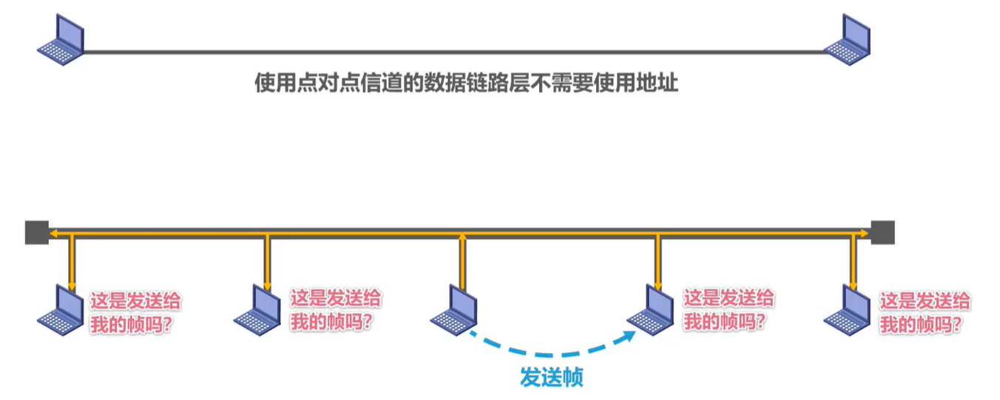
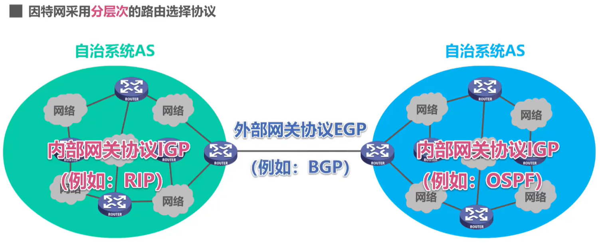

# 计算机网络

网络(Network)由若干结点(Node)和连接这些结点的链路(Link)组成。
因特网(Internet)是世界上最大的互连网络。

# keyword
- [七层模型](#七层模型) & [五层模型](#五层模型)
- [TCP三握手](#TCP使用“三报文握手”建立连接)
- [TCP四挥手](#TCP通过“四报文挥手”来释放连接)
- [TCP的拥塞控制](#TCP的拥塞控制)

### 1.  [计算机网络的定义和分类](#计算机网络的定义和分类)
### 2. [计算机网络的性能指标](#计算机网络的性能指标)
### 3. [计算机网络体系结构](#计算机网络体系结构)
### 4. [基础计算题](#基础计算题)
### 5. [物理层](#物理层)
### 6. [数据链路层](#数据链路层)
### 7. [MAC地址、IP地址、ARP协议](#MAC地址、IP地址、ARP协议)
### 8. [网络层](#网络层)
### 9. [传输层](#传输层)
### 10. [应用层](#应用层)

1983年，TCP/IP协议成为ARPANET的标准协议（<u>因特网诞生时间</u>）

## 因特网服务提供者ISP(Internet Service Provider)

基于ISP的三层结构的因特网

### 因特网的标准化工作

因特网协会ISOC是一个国际性组织，它负责对因特网进行全面管理，以及在世界范围内促进其发展和使用。

-   因特网体系结构委员会IAB,负责管理因特网有关协议的开发：

-   因特网工程部IETF,负责研究中短期工程问题，主要针对协议的开发和标准化：

-   因特网研究部IRTF,从事理论方面的研究和开发一些需要长期考虑的问题。

### 制订因特网的正式标准要经过以下4个阶段：

1.  因特网草案（在这个阶段还不是RFC文档）
2.  建议标准（从这个阶段开始就成为RFC文档）
3.  草案标准
4.  因特网标准

### 因特网的组成

-   边缘部分
    -   由所有连接在因特网上的主机组成。这部分是<u>用户直接使用</u>的，用来进行通信（传送数据、音频或视频）和资源共享
-   核心部分
    -   由<u>大量网络</u>和连接这些网络的<u>路由器</u>组成。这部分是为边缘部分提供服务的（提供连通性和交换）

### 报文交换(Message Switching)

不拆包发送

### 电路交换(Circuit Switching)

电话交换机接通电话线的方式称为电路交换；

从通信资源的分配角度来看，交换(Switching)就是按照某种方式动态地分配传输线路的资源；

#### 电路交换的三个步骤：

1.  建立连接(分配通信资源)
2.  通话（一直占用通信资源）
3.  释放连接(归还通信资源)

### 分组交换(Packet Switching)

# 计算机网络的定义和分类

#### 定义

-   没有精确统一的定义
-   最简单定义：互连、自治、计算机的集合
-   不同阶段定义不同，反映当时的网络技术发展水平

#### 按交换技术分类

-   电路交换网络
-   报文交换网络
-   分组交换网络

#### 按传输介质分类

-   有线网络
-   无线网络

#### 按覆盖范围分类

-   广域网WAN
-   城域网MAN
-   局域网LAN
-   个域网PAN

#### 按拓扑结构分类

-   总线型网络(被弃用)
-   星型网络
-   环型网络
-   网状型网络

# 计算机网络的性能指标

#### 速率

-   比特
    -   计算机中数据量的单位，也是信息论中信息量的单位。一个比特就是二进制数字中的一个1或0。
    -   1 Byte = 8 bit
    -   1 KB = 2^10 B = 1024 B(Byte) = 1024*8 bit …
    -   1 MB = 2^20 B = 1024 K
-   速率
    -   连接在计算机网络上的主机在数字信道上传送比特的速率，也称为<u>比特率</u>或<u>数据率</u>
    -   常用数据率单位: bit/s (b/s,bps)
    -   1 kb/s = 10^3 b/s (bps)
    -   1 Mb/s = 10^6 b/s (bps)

-   有一个待发送的数据块，大小为100MB,网卡的发送速率为100Mbps,则网卡发送完该数据块需要多长时间？
-   大概需要 8s左右

#### 带宽

-   带宽在摸拟信号系统中的意义
    -   信号所包含的各种不同频率成分所占据的频率范围；
        单位：Hz (kHz,MHz,GHz)
-   带宽在计算机网络中的意义
    -   用来表示网络的通信线路所能传送数据的能力，因此网络带宽表示在单位时间内从网络中的某一点到另一点所能通过的“最高数据率”；
    -   其实“带宽”的这两种表述之间有着密切的联系。一条通信线路的
        “频带宽度”越宽，其所传输数据的“最高数据率”也越高。
-   

#### 吞吐量

-   吞吐量表示在单位时间内通过某个网络（或信道、接口）的数据量。
-   吞吐量被经常用于对现实世界中的网络的一种测量，以便知道实际上到底有多少数据量能够通过网络。
-   吞吐量受网络的带宽或额定速率的限制。

#### 时延

网络时延包括

-   发送时延 1个
    -   分组长度(b)/发送速率(b/s) 主要因素为发送速率
-   传播时延 多个
    -   信道长度(m)/电磁波传播速率(m/s)
    -   根据不同的传播介质速率不同,主要因素为距离
    -   自由空间：3×10^8m/s
        铜线：2.3×10^8m/s
        光纤：2.0x10^8m/s
-   处理时延 多个
    -   不好计算,因为是数据流量是动态变化的(处理时延+排队时延)

#### 时延带宽积

-   时延带宽积 = 传播速率 x 带宽

-   若发送端连续发送数据，则在所发送的第一个比特即将到达终点时，发送端就已经发送了时延带宽积个比特
-   链路的时延带宽积又称为<u>以比特为单位的链路长度</u>。

#### 往返时间

往返时间`RTT`(Round-Trip Time)

-   在许多情况下，因特网上的信息不仅仅单方向传输，而是双向交互；
-   我们有时很需要知道双向交互一次所需的时间：

#### 利用率

1.  信道利用率:用来表示某信道有百分之几的时间是被利用的（有数据通过）
2.  网络利用率:全网络的信道利用率的加权平均。

根据排队论，当某信道的利用率增大时，该信道引起的时延也会迅速增加：

一些拥有较大主干网的SP通常会控制它们的信道利用率不超过50%。如果超过了，就要准备扩容，增大线路的带宽。

也不能使信道利用率太低，这会使宝贵的通信资源被白白浪费。应该使用一些机制，可以根据情况动态调整输入到网络中的通信量，使网络利用率保持在一个合理的范围内。

#### 丢包率

丢包率即分组丢失率，是指在一定的时间范围内，传输过程中丢失的<u>分组数量</u>与<u>总</u>
<u>分组数量</u>的比率：

丢包率具体可分为接口丢包率、结点丢包率、链路丢包率、路径丢包率、网络丢包率等

分组丢失的两个主要原因：

-   分组误码:在检测到误码的节点交换机被丢弃
-   结点交换机缓存队列满（网络拥塞）

因此，丢包率反映了网络的拥塞情况：

-   无拥塞时路径丢包率为 0
-   轻度拥塞时路径丢包率为 1%~4%
-   严重拥塞时路径丢包率为 5%~15%

# 计算机网络体系结构

### 常见的计算机网络体系结构

#### OS引体系结构 (开放系统互连参考模型) (弃用) 
##### 七层模型

-   法律国际标准

1.  应用层
2.  表示层
3.  会话层
4.  传输层
5.  网络层
6.  数据链路层
7.  物理层

#### TCP/IP体系结构 (现用)

-   事实上的国际标准

1.  应用层
2.  传输层
3.  网际层
4.  网络接口层

#### 原理体系结构 (教学)
##### 五层模型

1.  应用层
2.  传输层
3.  网络层
4.  数据链路层
5.  物理层

TCP/IP

IP协议可以为各种<u>网络应用</u>提供服务(Everything over IP)

使用IP协议互连不同的<u>网络接口</u> (IP over everything)

各种端使用TCP/IP所有层

网络路由器只用网络接口层和网际层

### 计算机网络体系结构分层的必要性

-   计算机网络是个非常复杂的系统
-   分层可将<u>庞大而复杂的问题</u>，转化为若干<u>较小的局部问题</u>

1.  应用层
    -   解决通过应用进程的交互来实现特定网络应用的问题
    -   数据包(报文message)
2.  传输层
    -   解决进程之间基于网络的通信问题
    -   数据包(TCP报文段segment/UDP用户数据报datagram)
3.  网络层
    -   解决分组在多个网络上传(路由)的问题
    -   数据包(IP数据报/分组packet)
4.  数据链路层
    -   解决分组在一个网络(或一段链路)上传输的问题
    -   数据包(帧frame)
5.  物理层
    -   解决使用何种信号来传输比特的问题
    -   数据包(比特流bit stream)

### 计算机网络体系结构分层思想举例

-   整个从源主机自顶向下的与服务器交互的数据传播过程

-   通过5层网络体系结构分层解析

-   通过浏览器进程与Wb服务器进程的交互实例，演示分组<u>逐层封装和解封</u>的过程

### 计算机网络体系结构中的专用术语

三个专业术语:实体,协议,服务

### 实体

#### 实体

-   任何可发送或接收信息的硬件或软件进程。

#### 对等实体

-   收发双方相同层次中的实体。

### 协议

#### 协议

-   控制两个对等实体进行逻辑通信的规则的集合。

#### 协议的三要素

-   #### 语法

    -   定义所交换信息的格式

-   #### 语义

    -   定义收发双方所要完成的操作

-   #### 同步

    -   定义收发双方的时序关系

### 服务

#### 服务

-   在协议的控制下，两个对等实体间的逻辑通信使得本层能够向上一层提供服务。

-   要实现本层协议，还需要使用下面一层所提供的服务。

#### 协议是“水平的”，服务是“垂直的

实体看得见相邻下层所提供的服务，但并不知道实现该服务的具体协议。

-   也就是说，下面的协议对上面的实体是”透明"的。

#### 服务访问点

-   在同一系统中相邻两层的实体交换信息的逻辑接口，用于区分不同的服务类型

-   数据链路层的服务访问点为帧的<u>“类型”</u>字段。
-   网络层的服务访问点为P数据报首部中的<u>“协议字段”</u>
-   传输层的服务访问点为<u>“端口号”</u>

#### 服务原语

-   上层使用下层所提供的服务必须通过与下层交换一些命令，这些命令称为服务原语。

#### 协议数据单元PDU(Protocol Data Unit)

-   对等层次之间传送的数据包称为该层的协议数据单元

#### 服务数据单元SDU(Service Data Unit)

-   同一系统内，<u>层与层之间交换的数据包</u>称为服务数据单元。
-   多个SDU可以合成为一个PDU;一个SDU也可划分为几个PDU。

# 基础计算题

分组等长，各链路长度相同、带宽也相同，忽略路由器的处理时延

n个分组，m段链路，则总时延是多少？

#### 总时延

-   n个分组的发送时延
-   1个分组的发送时延 x (m·1)
-   1段链路的传播时延 x m

# 物理层

物理层考虑的是怎样才能在连接各种计算机的传输媒体上传输数据比特流。

物理层为数据链路层屏蔽了各种传输媒体的差异，使数据链路层只需要考虑如何完成本层的协议和服务，而不必考虑网络具体的传输媒体是什么。

## 基本概念

### 传输媒体

#### 导引型传输媒体

-   双绞线
-   同轴电缆
-   光纤

#### 非导引型传输媒体(自由空间)

-   微波通信(2~40GHz)-Wifi

### 物理层包含四种特性

#### 机械特性

-   指明接口所用接线器的形状和尺寸引脚数目和排列、固定和锁定装置。

#### 电气特性

-   指明在接口电缆的各条线上出现的电压的范围。

#### 功能特性

-   指明某条线上出现的某一电平的电压表示何种意义。

#### 过程特性

-   指明对于不同功能的各种可能事件的出现顺序。

## 物理层下面的传输媒体

#### 绞合的作用

-   抵御部分来自外界的电磁波干扰
-   减少相邻导线的电滋干扰

## 传输方式

## 编码与调制

码元

-   在使用时间域的波形表示数字信号时，代表不同离散数值的基本波形。

#### 常用编码

#### 基本调制方法

通常情况下，相位和振幅可以结合起来一起调制，称为正交振幅调制QAM。

## 信道的极限容量

#### 奈氏准则(公式)

-   理想低通信道的最高码元传输速率=2 N Baud=2W(单位：码元/秒)
-   理想带通信道的最高码元传输速率=N Baud=W(单位：码元/秒)

#### 香农公式

-   c=W×log2(1+S/N)(单位：bit/s)

在信道带宽一定的情况下，根据奈氏准则和香农公式，要想提高信息的传输速率就必
须采用多元制（更好的调制方法）和努力提高信道中的信噪比。

自从香农公式发表后，各种新的信号处理和调制方法就不断出现，其目的都是为了尽
可能地接近香农公式给出的传输速率极限。

---

# 数据链路层

## 数据链路层概述

数据链路层在网络体系结构中所处的地位

#### 链路(Link)

-   就是从一个结点到相邻结点的一段物理线路，而中间没有任何其他的交换结点。

-   数据链路(Data Link)是指把实现通信协议的<u>硬件和软件</u>加到链路上，就构成了数据链路。

-   数据链路层<u>以帧为单位</u>传输和处理数据。

### 数据链路层的三个重要问题

#### 封装成帧

-   为将数据链层给网络层交付的协议数据单元,添动加帧头和尾的操作，称为封装成帧。
-   都是为了在链路上以帧为单位来传送数据，

#### 差错检测

-   根据<u>帧尾中的检错码</u>检测帧中是否有误码

#### 可靠传输

-   尽管误码是不能完全避免的，但若能实现发送方发送什么，
-   接收方就能收到什么，就称为可靠传输。

使用<u>点对点信道</u>的数据链路层有以上问题

使用<u>广播信道</u>的数据链路层还有以下问题

-   编址问题
-   同时使用总线传输帧时,产生碰撞(共享式局域网不可避免的)
    -   以太网的媒体接入控制协议CSMA/CD (载波监听多点接入/碰撞检测)
    -   802.11局域网的媒体接入控制协议CSMA/CA

### 封装成帧

<u>封装成帧</u>是指数据链路层给上层交付的协议数据单元添加帧头和帧尾使之成为帧。

-   帧头和帧尾中包含有重要的控制信息。
-   帧头和帧尾的作用之一就是帧定界。

<u>透明传输</u>是指数据链路层对上层交付的传输数据没有任何限制，就好像数据链路层不存在一样。

-   面向字节的物理链路使用字节填充（或称字符填充）的方法实现透明传输。
    -   用转义字符
-   面向比特的物理链路使用比特填充的方法实现透明传输。
    -   零比特填充法(每5个连续1后面插入一个比特0)(数据使用时再剔除)

为了提高帧的传输效率，应当使帧的<u>数据部分的长度尽可能大</u>些。

考虑到差错控制等多种因素，每一种数据链路层协议都规定了帧的数据部分的<u>长度上限</u>，即<u>最大传送单元</u>MTU(Maximum Transfer Unit)

### 差错检测

#### 奇偶校验

-   在待发送的数据后面添加1位奇偶校验位，使整个数据（包括所添加的校验位在内）中“1”的个数为奇数（奇校验）或偶数（偶校验）。

-   如果有奇数个位发生误码，则奇偶性发生变化，可以检查出误码：

#### 循环冗余校验CRC(Cyclic Redundancy Check)

-   <u>检错码</u>只能检测出帧在传输过程中出现了差错，但<u>并不能定位错误</u>，因此无法纠正错误。
-   要想纠正传输中的差错，可以使用冗余信息更多的<u>纠错码</u>进行前向纠错。但纠错码的<u>开销比较大</u>，在计算机网络中较少使用。
-   循环冗余校验CRC有很好的检错能力（漏检率非常低），虽然计算比较复杂，但非常易于用硬件实现，因此被<u>广泛应用于数据链路层</u>。
-   在计算机网络中通常采用我们后续课程中将要讨论的检错重传方式来纠正传输中的差错，或者仅仅是丢弃检测到差错的帧，这取决于数据链路层向其上层提供的是可靠传输服务还是不可靠传输服务。

## 可靠传输的基本概念

使用差错检测技术（例如循环冗余校验CRC),接收方的数据链路层就可检测出帧在
传输过程中是否产生了误码（比特错误）

-   比特差错只是传输差错中的一种。
-   从整个计算机网络体系结构来看，传输差错还包括<u>分组丢失</u>、<u>分组失序</u>以及<u>分组重复</u>。
-   分组丢失、分组失序以及分组重复这些传输差错，一般不会出现在数据链路层，而会出现在其上层。
-   可靠传输服务并不仅局限于数据链路层，其他各层均可选择实现可靠传输。

#### 802.11无线局域网要求数据链路层实现<u>可靠传输</u>

#### 以太网<u>不要求</u>数据链路层实现可靠传输

#### IP向其上层提供<u>无连接、不可靠</u>传输服务

#### TCP向其上层提供<u>面向连接的可靠</u>传输服务

#### UDP向其上层提供<u>无连接、不可靠</u>传输服务

#### 可靠传输的实现比较复杂，开销也比较大，是否使用可靠传输取决于应用需求

## 可靠传输的实现机制

-   停止-等待协议SW
-   回退N帧协议GBN
-   选择重传协议SR

这三种可靠传输实现机制的基本原理并不仅限于数据链路层可以应用到计算机网络体系结构的各层协议中

## 停止-等待协议SW (Stop-and-Wait)

-   #### ACK分组(确认分组) / NAK分组(否认分组)

-   接收端检测到数据分组有误码时，将其丢弃并等待发送方的超时重传。但对于误码率较高的点对点链路，为使发送方<u>尽早重传</u>，也可给发送方发送<u>NAK分组</u>

-   为了让接收方能够判断所收到的数据分组<u>是否是重复</u>的，需要给数据分组编号。由于停止-等待协议的停等特性，只需1个比特编号就够了，即编号0和1

-   为了让发送方能够判断所收到的ACK分组<u>是否是重复</u>的，需要给ACK分组编号，所用比特数量与数据分组编号所用比特数量一样。<u>数据链路层一般不会出现ACK分组迟到的情况</u>，因此在数据链路层实现停止-等待协议可以不用给ACK分组编号

-   超时计时器设置的<u>重传时间</u>应仔细选择。一般可将重传时间选为略大于“从发送方到接收方的平均往返时间”。

    -   在数据链路层点对点的往返时间比较确定，重传时间比较好设定。
    -   然而在传输层，由于端到端往返时间非常不确定，设置合适的重传时间有时并不容易。

#### 停止-等待协议的信道<u>利用率</u> U

-   当往返时延RTT远大于数据帧发送时延TD时（例如使用卫星链路），信道利用率非常低。

-   若出现重传，则对于传送有用的数据信息来说，信道利用率还要降低。
-   为了克服停止-等待协议信道利用率很低的缺点，就产生了另外两种协议，
    即<u>后退N帧协议GBN</u>和<u>选择重传协议SR</u>。

#### 以上为 自动请求重传ARQ(Automatic Repeat reQuest)

## 回退N帧协议GBN (Go-Back-N)

### 发送方

1.  发送窗口尺寸W~T~的取值范围是
    -   其中，n是构成分组序号的比特数量。
    -   (停止-等待协议)
    -   接收方无法分辨新、旧数据分组
2.  发送方可在未收到接收方确认分组的情况下，将序号落在发送窗口内的多个数据分组全部发送出去
3.  发送方只有收到对已发送数据分组的确认时，发送窗口才能向前相应滑动
    -   发送方收到多个重复确认时，可在重传计时器超时前尽早开始重传，由具体实现决定。
    -   发送方发送窗口内某个已发送的数据分组产生超时重发时，其后续在发送窗口内且<u>已发送的数据分组也必须全部重传</u>，这就是**回退N帧**协议名称的由来。

### 接收方

1.  接收窗口尺寸W~R~的取值范围是

    -   因此接收方只能按序接收数据分组。
2.  接收方只接收序号落在接收窗口内且无误码的数据分组，并且将接收窗口向前滑动一个位置，与此同时给发送方发回相应的确认分组。为了减少开销，接收方不一定每收到一个按序到达且无误码的数据分组就给发送方发回一个确认分组
    -   而是可以在连续收到好几个按序到达且无误码的数据分组后（由具体实现决定），才针对最后一个数据分组发送确认分组，这称为**累积确认**
    -   或者可以在自己有数据分组要发送时才对之前按序接收且无误码的数据分组进行**捎带确认**
3.  接收方收到未按序到达的数据分组，除丢弃外，还要对最近按序接收的数据分组进行确认

-   回退N帧协议在流水线传输的基础上利用发送窗口来限制发送方连续发送数据分组的数量，是一种**连续ARQ协议**。
-   在协议的工作过程中发送窗回口和接收窗口不断向前滑动，
    因此这类协议又称为**滑动窗口协议**。
-   由于回退N帧协议的特性，当通信线路质量不好时，其信道利用率并不比停止等待协议高。

回退N帧协议的接收窗口尺寸W只能等于1，因此接收方只能按序接收正确到达的数据分组。
一个数据分组的误码就会导致其后续多个数据分组不能被接收方按序接收而丢弃（尽管它们无乱序和误码)。这必然会造成发送方对这些数据分组的超时重传，显然这是对通信资源的极大浪费。

为了进一步提高性能，可设法只重传出现误码的数据分组。
因此，<u>接收窗口的尺寸W~R~不应再等于1</u>（而应大于1），<u>以便接收方先收下失序到达但无误码并且序号落在接收窗口内的那些数据分组</u>，等到所缺分组收齐后再一并送交上层。这就是**选择重传协议**。

### 选择重传协议SR (Selective Request)

### 发送方

1.  发送窗口尺寸W~T~的取值范围是
    -   其中，是构成分组序号的比特数量。
    -   (停止-等待协议)
    -   接收方无法分辨新、旧数据分组
2.  发送方可在未收到接收方确认分组的情况下，将序号落在发送窗口内的多个数据分组全部发送出去
3.  发送方只有按序收到对已发送数据分组的确认时，发送窗口才能向前相应滑动；若收到未按序到达的确认分组时，对其进行记录，以防止其相应数据分组的超时重发，但发送窗口不能向前滑动

### 接收方

1.  接收窗口尺寸W~R~的取值范围是
    -   (停止-等待协议)
    -   无意义
2.  接收方可接收未按序到达但没有误码并且序号落在接
    收窗口内的数据分组
    -   为了使发送方仅重传出现差错的分组，接收方不能
        再采用累积确认，而需要对每个正确接收到的数据
        分组进行逐一确认！
3.  接收方只有在按序接收数据分组后，接收窗口才能向
    前相应滑动。

## 点对点协议PPP(Point-to-Point Protocol)

因为时是点对点所以**不需要MAC地址**参与

-   是目前使用最广泛的点对点**数据链路层协议**。

在1999年公布的在以太网上运行的PPP协议，即PPP over Ethernet,简称为PPPoE。

PPP协议为在点对点链路传输各种协议数据报提供了一个标准方法，
主要由以下三部分构成：

-   对各种协议数据报的封装方法（封装成帧）
-   链路控制协议LCP  用于建立、配置以及测试数据链路的连接
-   一套网络控制协议NCPs  其中的每一个协议<u>支持不同的网络层协议</u>

### 帧格式

-   标志(**F**lag)字段：PPP帧的定界符，取值为0x7E

-   地址(**A**ddress)字段：取值为OxFF,预留（目前没有什么作用）

-   控制(**C**ontrol)字段：取值为0x03,预留（目前没有什么作用）

-   协议(**P**rotocol):字段：指明帧的数据部分送交哪个协议处理

    -   取值0x0021表示：帧的数据部分为IP数据报
        -   

    -   取值0xC021表示：帧的数据部分为LCP分组

    -   取值0x8021表示：帧的数据部分为NCP分组

-   帧检验序列(**F**rame **C**heck **S**equence)字段：**CRC**计算出的校验位

-   标志(**F**lag)字段：PPP帧的定界符，取值为0x7E

#### 透明传输一面向字节的异步链路采用插入转义字符的字节填充法

发送方的处理：	

-   出现的每一个7E(PPP帧的定界符)字节转变成2字节序列(7D,5E)。
-   出现的每一个7D(转义字符)字节转变成2字节序列(7D,5D)。
-   出现的每一个ASC码控制字符（数值小于0x20的字符），则在该字符前面插入一个7D字节，同时将该字符的编码加上0x20。

接收方的处理：

-   进行反变换即可恢复出原来的帧的数据部分。

#### 透明传输一面向比特的同步链路采用插入比特0的比特填充法

发送方的处理：

-   对帧的数据部分进行扫描（一般由硬件实现）。只要发现5个连续的比特1，则立即填充1个比特0。

接收方的处理：

-   对帧的数据部分进行扫描（一般由硬件实现）。只要发现5个连续的比特1，就把其后的1个比特0删除。

#### 差错检验

接收方每收到一个PPP帧，就进行**CRC**检验。若CRC检验正确，就收下这个帧；反之，就丢弃这个帧。

RFC1662的附录部分给出了FCS的计算方法的C语言实现（查表法）

-   为了减少cpu计算压力

**使用PPP的数据链路层向上不提供可靠传输服务**

#### 工作状态

## 媒体接入控制的基本概念

共享信道要着重考虑的一个**问题**就是如何协调多个发送和接收站点对一个共享传输媒体的占
用，即**媒体接入控制MAC**(Medium Access Control)。

随着技术的发展，交换技术的成熟和成本的降低，具有更高性能的使用**点对点链路**和**链路层交换机的交换式局域网**在**有线领域****已完全取代了共享式局域网**

但由于无线信道的广播天性，**无线局域网仍然使用的是共享媒体技术**。

## 静态划分信道

### 信道复用

#### 频分复用FDM

#### 时分复用TDM

#### 波分复用WDM

码分复用CDM是另一种共享信道的方法。实际上，由于该技术主要用于多址接入，人们更常用
的名词是码分多址CDMA(Code Division Multiple Access)。

在本课程中，我们不严格区分复用与多址的概念。可简单理解如下：

-   **复用** 是将单一媒体的频带资源划分成很多子信道，这些子信道之间相互独立，互不干扰。从媒体的整体频带资源上看，每个子信道只占用该媒体频带资源的一部分。
-   **多址**（更确切地应该称为多点接入）处理的是动态分配信道给用户。这在用户仅仅暂时性地占用信道的应用中是必须的，而所有的移动通信系统基本上都属于这种情况。相反，在信道永久性地分配给用户的应用中，多址是不需要的（对于无线广播或电视广播站就是这样）。

#### 码分复用CDM

## 总线局域网使用的协议：CSMA/CD

#### 媒体接入控制一动态接入控制一**随机接入**

#### 载波监听多址接入/碰撞检测CSMA/CD

#### (Carrier Sense Multiple Access/Collision Detection)

#### 争用期（碰撞窗口）

#### 最小帧长

#### 最大帧长

#### 截断二进制指数退避算法

#### 端到端传播时延 τ

#### 争用期 2τ

#### 信道利用率

#### 帧发送流程

#### 帧接收流程

CSMA/CD协议曾经用于各种总线结构以太网和双绞线以太网的早期版本中

#### 现在的以太网基于交换机和全双工连接，不会有碰撞，因此没有必要使用CSMA/CD协议

## 无线局域网使用的协议：CSMA/CA

### 媒体接入控制一动态接入控制一**随机接入**

#### 载波监听多址接入/碰撞避免CSMA/CA

#### (Carrier Sense Multiple Access/Collision Avoidance)

-   这种未能检测出信道上其他站点信号的问题叫做**隐蔽站**问题。

-   802.11无线局域网使用CSMA/CA协议，在CSMA的基础上增加了一个**碰撞避免CA**功能，而不再实现碰撞检测功能。
-   由于不可能避免所有的碰撞，并且无线信道**误码率较高**，802.11标准还使用了数据链路层确认机制<u>（停止-等待协议）</u>来保证数据被正确接收。
-   802.11的MAC层标准定义了两种不同的媒体接入控制方式：
    -   分布式协调功能**DCF**(Distributed Coordination Function)。
        在DCF方式下，没有中心控制站点，每个站点使用CSMA/CA协议通过<u>争用信道</u>来获取发送权，这是802.11定义的默认方式。
    -   点协调功能**PCF**(Point Coordination Function)。
        PCF方式使用<u>集中控制的接入算法</u>（一般在接入点AP实现集中控制)，是802.11定义的可选方式，在实际中较少使用。

帧间间隔**IFS**(**I**nter**F**rame **S**pace)

-   802.11标准规定，所有的站点必须在持续检测到信道空闲一段指定时间后才能发送帧，这段时间称为帧间间隔IFS。
-   帧间间隔的长短取决于该站点要发送的帧的类型：
    -   高优先级帧需要等待的时间较短，因此可优先获得发送权；
    -   低优先级帧需要等待的时间较长。若某个站的低优先级帧还没来得及发送，而其他站的高优先级帧已发送到信道上，则信道变为忙态，因而低优先级帧就只能再推迟发送了。这样就减少了发生碰撞的机会。
-   常用的两种帧间间隔如下：
    -   短帧间间隔**SIFS**(28μS),是最短的帧间间隔，用来分隔开属于一次对话的各帧。一个站点应当能够在这段时间内从发送方式切换到接收方式。使用SIFS的帧类型有ACK帧、CTS帧、由过长的MAC帧分片后的数据帧、以及所有回答AP探询的帧和<u>在PCF方式中接入点AP发送出的任何帧</u>。
    -   DCF帧间间隔**DIFS**(128μS),它比短帧间间隔SIFS要长得多，<u>在DCF方式中用来发送数据帧和管理帧</u>。

#### CSMA/CA协议的工作原理

-   当站点检测到信道是空闲的，并且所发送的数据帧不是成功发送完上一个数据帧之后立即连续发送的数据帧，则不使用退避算法。(并非长期占信道)
-   以下情况必须使用退避算法：
    -   在发送数据帧之前检测到信道处于忙状态时
    -   在每一次重传一个数据帧时
    -   在每一次成功发送后要连续发送下一个帧时（这是为了避免一个站点长时间占用信道）

#### CSMA/CA协议的退避算法

-   在执行退避算法时，站点为退避计时器设置一个随机的退避时间：
    -   当退避计时器的时间减小到零时，就开始发送数据；
    -   当退避计时器的时间还未减小到零时而信道又转变为忙状态，这时就冻结退避计时器的数值，重新等待信道变为空闲，再经过时间DFS后，继续启动退避计时器。
-   在进行第i次退避时，退避时间在时隙编号{0,1，…，2^2+i^-1}中随机选择一个，然后乘以基本退避时间（也就是一个**时隙**的长度）就可以得到随机的退避时间。这样做是为了使不同站点选择相同退避时间的概率减少。当时隙编号达到255时（对应于<u>第6次退避)就不再增加</u>了。

#### CSMA/CA协议的信道预约和**虚拟载波监听**

为了尽可能减少碰撞的概率和降低碰撞的影响，802.11标准允许要发送数据的站点对信道进行预约。

1.  源站在发送数据帧之前先发送一个短的控制帧，称为请求发送RTS(**R**equest **T**o **S**end),它包括源地址、目的地址以及这次**通信（包括相应的确认帧)所需的<u>持续时间</u>**。
2.  若目的站正确收到源站发来的RTS帧，且媒体空闲，就发送一个响应控制帧，称为允许发送CTS(**C**lear **T**o **S**end)),它也包括这次通信所需的持续时间（从RTS帧中将此持续时间复制到CTS帧中）。
3.  源站收到CTS帧后，再等待一段时间SIFS后，就可发送其数据帧。
4.  若目的站正确收到了源站发来的数据帧，在等待时间SFS后，就向源站发送确认帧ACK。
5.  

-   <u>除源站和目的站以外的其他各站，在收到CTS帧（或数据帧）后就推迟接入到无线局域网中。</u>这样就保证了源站和目的站之间的通信不会受到其他站的干扰。
-   如果RTS帧发生碰撞，源站就收不到CTS帧，需执行退避算法重传RTS帧。
-   由于RTS帧和CTS帧很短，发送碰撞的概率、碰撞产生的开销及本身的开销都很小。而对于一般的数据帧，其发送时延往往大于传播时延（因为是局域网），碰撞的概率很大，且一旦发生碰撞而导致数据帧重发，则浪费的时间就很多，因此用很小的代价对信道进行预约往往是值得的。
    802.11标准规定了3种情况供用户选择：
    -   使用RTS帧和CTS帧
    -   不使用RTS帧和CTS帧
    -   只有当数据帧的长度超过某一数值时才使用RTS帧和CTS帧

除RTS帧和CTS帧会携带通信需要持续的时间，数据帧也能携带通信需要持续的时间，这称802.11的虚拟载波监听机制。
由于利用虚拟载波监听机制，站点只要监听到RTS帧、CTS帧或数据帧中的任何一个，就能知道信道被占用的持续时间，而不需要真正监听到信道上的信号，
因此虚拟载波监听机制能**减少隐蔽站带来的碰撞问题**。

---

# MAC地址、IP地址、ARP协议

## MAC地址

使用点对点(PPP)信道的数据链路层**不需要使用地址**

-   当多个主机连接在同一个广播信道上，要想实现两个主机之间的通信，则每个主机都必须有一个唯一的标识，即一个**数据链路层地址**；

-   在每个主机发送的帧中必须携带标识发送主机和接收主机的地址。由于这类地址是用于媒体接入控制**MAC**(**M**edia **A**ccess **C**ontrol)),因此这类地址被称为MAC地址；

    -   MAC地址一般被固化在**网卡（网络适配器）**的电可擦可编程只读存储器EEPROM中，因此MAC地址也被称为硬件地址；
    -   MAC地址有时也被称为物理地址。请注意：这并不意味着MAC地址属于网络体系结构中的物理层！

-   一般情况下，用户主机会包含两个网络适配器：有线局域网适配器（有线网卡）和无线局域网适配器（无线网卡)。<u>每个网络适配器都有一个全球唯一的MAC地址。</u>而交换机和路由器往往拥有更多的网络接口，所以会拥有更多的MAC地址。

    综上所述，严格来说，**MAC地址是对网络上各接口的唯一标识**，而不是对网络上各设备的唯一标识。

#### EUI-48

对于使用EUI-48空间的应用程序，IEEE的目标寿命为100年（直到2080），但是鼓励采用EUI-64作为替代。

#### 广播MAC地址:FF-FF-FF-FF-FF-FF

#### IEEE 802局域网的MAC地址发送顺序

字节发送顺序：第一字节 -> 第六字节
字节内的比特发送顺序： b~0~ -> b~7~

#### 给主机配置**多播组列表进行私有应用**时，**不得使用公有的标准多播地址**具体可在以下网址查询http://standards.ieee.org/develop/regauth/grpmac/public.html

#### 目前，大多数移动设备已经采用了随机MAC地址技术。

## IP地址

IP地址是因特网(Internet)上的主机和路由器所使用的地址，用于标识两部分信息：

-   网络编号：标识因特网上数以百万计的网络
-   主机编号：标识**同一网络**上不同主机（或路由器各接口）

很显然，之前介绍的**MAC地址不具备区分不同网络的功能**。

-   如果只是一个单独的网络，不接入因特网，可以只使用MAC地址
    （这不是一般用户的应用方式）
-   如果主机所在的网络要接入因特网，则IP地址和MAC地址都需要使用。

#### 从网络体系结构看IP地址与MAC地址

#### 数据包转发过程中IP地址与MAC地址的变化情况

## ARP

#### 每始主机都会有一个ARP高速缓存表。

#### 每次收到ARP(请求/响应)报文请求时,都会更新自己的ARP高速缓存表

#### ARP的作用范围：逐段链路或逐个网络使用,不能跨网络使用

ARP高速缓存表中的每一条记录:

-   动态：自动获取，生命周期默认为两分钟
-   静态：手工设置，不同操作系统下的生命周期不同，例如系统重启后不存在或系
    统重启后依然有效。

## 集线器与交换机的区别

#### 单播:单播即有准确目的和源的数据传输

#### 在**物理层**扩展以太网的**集线器**

#### 在**数据链路层**扩展以太网的**交换机**。(也包括物理层)

-   冒前市场上也有包含**网络层**部分功能的交换机,称为三层交换机

#### 使用集线器和交换机扩展以太网在广播域上都是相同的

#### 集线器

使用双绞线和集线器HUB的星型以太网使用集线器的以太网在逻辑上仍是一个**总线网**，各站
共享总线资源，使用的还是**CSMA/CD协议**；

**集线器只工作在物理层**，它的每个接口仅简单地转发比特，**不进行碰撞检测**（由各站的网卡检测）；

集线器一般都有少量的容错能力和网络管理功能。例如，若网络中某个网卡出了故障，不停地发送帧。此时，集线器可以检测到这个问题，在内部断开与出故障网卡的连线，使整个以太网仍然能正常工作。

使用集线器的以太网在逻辑上是**共享总线**的,需要使用CSMA/CD协议来协调洛主机净用总线，只能工作在**半双工模式**，<u>也就是收发帧不能同时进行</u>。

#### 在同一个总线下的以太网为一个碰撞域(冲突域)

仅使用集线器扩展以太网会扩大了广播域也扩大了碰撞域(冲突域)

#### 交换机

以太网交换机通常都有**多个接口**。每个接口都可以直接与一台主机或另一个以太网交换机相连。一般都工作在**全双工方式**，<u>也就是收发帧可以同时进行</u>。

-   <u>以太网交换机具有并行性，能同时连通多对接口</u>，<u>使多对主机能同时通信</u>，**无碰撞**（不使用CSMA/CD协议）
-   以太网交换机一般都具有多种速率的接口，例如：10Mb/s、100Mb/s、1Gb/5、10Gb/s接的多种组合。
-   以太网交换机工作在数据链路层（也包括物理层），它收到帧后，在**帧交换表**中查找帧的
    <u>目的MAC地址所对应的接口号</u>，然后通过该接口转发帧。
-   以太网交换机是一种**即插即用设备**，其内部的<u>帧交换表是通过自学习算法自动地逐渐建立</u>起来的。
-   帧的两种转发方式：
    1.  存储转发
    2.  直通交换：采用基于硬件的交叉矩阵（交换时延非常小，但不检查帧是否右差错)

#### 使用交换机扩展以太网只会扩大广播域不会扩大其碰撞域(冲突域)

-   交换机可以隔离碰撞域

#### 

### A->B 发送单播帧

集线器(HUB)会给同一局域网下的**所有主机**都发送该帧

交换机(SWITCH)仅会传输该单播帧给**目的主机**

### A和C->B 同时发送单播帧

集线器(HUB)会给同一局域网下的**所有主机**都发送该帧

-   然后两单播帧产生碰撞
-   遭遇碰撞的帧会传播到总线上的各主机。

交换机(SWITCH)仅会传输该单播帧给**目的主机**

-   收到多个帧时会将他们缓存起来
-   然后逐个转发给目的主机,然后不会产生碰撞

### 交换机工作原理(转发帧)

交换机在初次使用时,帧交换表是空的

1.  当有一个主机A接入1端口后,发送帧时,
    -   即映射主机A的MAC地址和1端口的关系,即更新帧交换表.

2.  当帧交换表中没有该帧目的地址端口映射关系时,
    -   即泛洪(盲目转发该帧)

3.  B接收到A发来的帧后,确定是MAC地址是自己,然后向A发送帧
    -   此时交换机从2端口获取到该帧,更新帧交换表,主机B的MAC地址->2端口

### 以太网交换机的生成树协议 STP(Spanning Tree Protocol)

-   当链路故障时需要冗余链路来维系以太网连接
    -   添加冗余链路可以提高以太网的可靠性
-   但是，冗余链路也会带来负面效应一形成**网络环路**
-   网络环路会带来以下问题：
    -   **广播风暴**
        -   大量消耗网络资源，使得网络无法正常转发其他数据帧：
    -   主机**收到重复的广播帧**
        -   大量消耗主机资源
    -   交换机的帧交换表震荡(漂移)
        -   交换机不断擦写端址映射
-   以太网交换机使用**生成树协议STP**(**S**panning **T**ree **P**rotocol),可以在增加冗余链路来提高网络可靠性的同时又避免网络环路带来的各种问题。
    -   不论交换机之间采用怎样的物理连接，交换机都能够自动计算并<u>构建一个逻辑上设有环路的网络</u>，其**逻辑拓扑结构必须是<u>树型</u>**的（无逻辑环路）；
    -   最终生成的树型逻辑拓扑要确保连通整个网络：
    -   当首次连接交换机或网络物理拓扑发生变化时（有可能是人为改变或故障），交换机都将进行**生成树的重新计算**。
    -   
-   生成树算法STA已超出本系列课程的教学大纲。对STA有兴趣的同学可参看我们的另一个系列课程《计算机网络简明教程和仿真实验》。

### 虚拟局域网 VLAN 概述 (Virtual Local Area Network)

以太网交换机工作在数据链路层（也包括物理层）

使用一个或多个以太网交换机互连起来的交换式以太网，其所有站点都**属于同一个广播域**。

-   随着交换式以太网规模的扩大，广播域相应扩大。
-   <u>巨大的广播域会带来很多**弊端**：</u>
    -   广播风暴
    -   难以管理和维护
    -   潜在的安全问题

网络中会频繁出现广播信息(TCP/IP协议栈中很多协议都会使用广播，例如ARP、RIP、DHCP等)

-   分割广播域的方法：使用路由器可以隔离广播域，但路由器成本较高，虚拟局域网VLAN技术应运而生。
-   虚拟局域网VLAN(**V**irtual **L**ocal **A**rea **N**etwork)是一种将局域网内的设备划分成**与物理位置无关的逻辑组**的技术，这些逻辑组具有某些共同的需求。

**IEEE802.1Q帧**（也称Dot One Q帧）对以太网的MAC帧格式进行了扩展，插入了4字节的VLAN标记。

-   VLAN标记的最后 12bit 称为VLAN标识符**VID**,它唯一地标志了以太网帧属于哪一个VLAN。
    -   VID的取值范围是0 \~ 4095(0 ~ 2^12^-1)
    -   0和4095都不用来表示VLAN,因此用于表示VLAN的VID的有效取值范围是1~4094。

交换机各端口的缺省VLAN ID

-   在思科交换机上称为Native VLAN,即本征VLAN。
-   在华为交换机上称为Port VLAN ID,即端口VLAN ID,简记为**PVID**。

802.1Q帧是由交换机来处理的，而不是用户主机来处理的。

-   当交换机收到普通的以太网帧时，会将其插入4字节的VLAN标记转变为802.1Q帧，
    简称**打标签**。
-   当交换机转发802.1Q帧时，可能会删除其4字节VLAN标记转变为普通以太网帧，
    简称**去标签**。

-   交换机的端口类型：Access Trunk Hybrid

# 网络层

## 网络层概述

网络层的主要任务是**实现网络互连**，进而实现数据包在各网络之间的传输

要实现网络层任务，需要解决以下主要问题：

-   网络层**向传输层提供怎样的服务**（“可靠传输”还是“不可靠传输”)

-   网络层**寻址问题**

-   **路由选择**问题

因特网(Internet)是目前全世界用户数量最多的互联网，它使用**TCP/P协议栈**

由于TCP/P协议栈的网络层使用网际协议IP,它是整个协议栈的核心协议，因此在TCP/IP协议栈中网络层常称为**网际层**。

综上所述，我们通过学习TCP/P协议栈的网际层来学习网络层的理论知识和实践技术。

## 网络层提供的两种服务

由于TCPP体系结构的因特网的网际层提供的是简单灵活、无连接的、尽最大努力交付的数据报服务，因此本章主要围绕网际层如何传送IP数据报这个主题进行讨论。

## IPv4地址概述

在TCP/IP体系中，IP地址是一个最基本的概念，我们必须把它弄清楚。

IPv4地址就是给因特网(Internet)上的每一台主机（或路由器）的每一个接口分配一个在全世界范围内是**唯一的32比特的标识符**。

IP地址由因特网名字和数字分配机构ICANN(Internet Corporation for Assigned Names and Numbers)进行分配。

-   我国用户可向亚太网络信息中心APNIC(Asia Pacific Network Information Center)申请IP地址，需要缴费。

-   2011年2月3日，互联网号码分配管理局IANA(由ICANN行使职能)宣布，IPV4地址已经分配完毕。

-   我国在2014至2015年也逐步停止了向新用户和应用分配IPV4地址。同时全面开展商用部署IPv6。

32比特的IPV4地址不方便阅读、记录以及输入等，因此IPV4地址采用**点分十进制表示方法**以方便用户使用。

#### 8位无符号二进制整数转十进制数

#### 十进制正整数转8位无符号二进制数

#### 除2取余法(还有扩展的除10取余法->用于截取十进制数的每一位)

#### 凑值法（必须熟记8位二进制数各位的权值128 64 32 16 8 4 2 1)

## **分类编址**的IPv4地址 (两级结构)

**主机号为“全0”的地址是网络地址**，不能分配给主机或路由器的各接口

**主机号为“全1”的地址是广播地址**，不能分配给主机或路由器的各接口

## **划分子网**的IPv4地址 (三级结构)

-   为新增网络申请新的网络号会带来以下弊端：
    -   需要等待时间和花费更多的费用
    -   会增加其他路由器中路由表记录的数量
    -   浪费原有网络号中剩余的大量IP地址

-   32bit的**子网掩码**可以表明分类IP地址的主机号部分被借用了几个比特作为子网号
    -   子网掩码使用连续的比特1来 对应网络号和**子网号**(从主机号那借的几位)
    -   子网掩码使用连续的比特0来 对应主机号
    -   将划分子网的IPv4地址与其相应的子网掩码进行**逻辑与运算**就可得到IPv4地址所在子网的网络地址

#### 子网就相当于在A类中**分出更细**的类[B类C类]的网络群

从主机号中**借的位数越多,分的子网就越多**,相应的每个单独子网中的IP地址就越少

-   且每借一位,就要比原本少2,因为每个子网都要有自己的网络地址(全0)和广播地址(全1)'

#### 广播地址比其所在的子网的任一IP地址都要大,网络地址正相反

如果可知

-   子网掩码按顺序划分子网,子网位越多,划分子网越多,子网内IP地址越少,因为每大类子网IP地址有限

**设 子网号所占位数为X,主机号剩余位数为Y,**

-   则 划分出的子网数量为 2^x^ 个
-   则 每个子网可分配的地址数量 2^Y^-2 个

#### 默认子网掩码:

-   即每类[ABC类]不细分子网的情况
-   默认的子网掩码是指在未划分子网的情况下使用的子网掩码。
    -   A类：255.0.0.0
    -   B类：255.255.0.0
    -   C类：255.255.255.0

## **无分类编址**的IPv4地址

划分子网在一定程度上缓解了因特网在发展中遇到的困难，但是数<u>量巨大的C类网因为其地址空间太小并没有得到充分使用</u>，而因特网的IP地址仍在加速消耗，整个IPV4地址空间面临全部耗尽的威胁。

为此，因特网工程任务组ETF又提出了采用无分类编址的方法来解决P地址紧张的问题，同时还专门成立PV6工作组负责研究新版本P以彻底解决P地址耗尽问题。

1993年，IETF发布了**无分类域间路由选择**CIDR****(**C**lassless **I**nter-**D**omain **R**outing)的RFC文档：RFC1517~1519和1520。**(可以读作Sider)**

-   CIDR消除了传统的A类、B类和C类地址，以及划分子网的概念；
-   CIDR可以更加有效地分配IPv4的地址空间，并且可以在新的IPv6使用之前允许因特网的规模继续增长。

CIDR使用“斜线记法”，或称CIDR记法。即在IPV4地址后面加上斜线**/**，在斜线后面写上网络前缀所占的比特数量。

CIDR实际上是将网络前缀都相同的连续的IP地址组成一个“CIDR地址块”(即可分地址)。

我们只要知道CIDR地址块中的任何一个地址，就可以知道该地址块的全部细节：

-   地址块的最小地址

-   地址块的最大地址

-   地址块中的地址数量 (2^32-划分网络位^)

-   地址块聚合某类网络(A类、B类或C类)的数量 (2^逻辑子网位^)

-   地址掩码（也可继续称为子网掩码）

**路由聚合（构造超网）**的方法是找**共同前缀**

网络前缀越长，地址块越小，路由越具体；(相当于可动态划分子网,用新的共同网络号划分子网)

若路**由器查表转发分组时发现有多条路由可选**，则**选择网络前缀最长的那条**，这称为**最长前缀匹配，因为这样的路由更具体。**

## IPV4地址的应用规划

## IP数据报的发送和转发过程

主机 通过 将目的IP与自己的子网掩码相与,得出的子网网络号不相等即为其他子网的目的主机

跨子网通信时,主机会向指定**默认网关**(路由器对应接口IP)发送数据帧

-   主机 发送 IP数据报
    -   判断目的主机是否与自己在同一个网络
        -   若在同一个网络，则属于**直接交付**
        -   若不在同一个网络，则属于**间接交付**，传输给主机所在网络的默认网关(路由器)，由默认网关帮忙转发

-   路由器 转发 IP数据报

    1.  检查IP数据报首部是否出错
        -   若出错，则直接丢弃该IP数据报并通告源主机：
        -   若没有出错，则进行转发

    1.  根据引IP数据报的目的地址在路由表中查找匹配的条目
        -   若找到匹配的条目，则转发给条目中指示的下一跳
            -   
            -   一般地址掩码都简写到目的地址斜杠后 即**sider**形式(192.168.0.0/25)
            -   用**目的IP和路由表中地址掩码相与**得出相同的目的网络,然后转发对应的下一跳接口
        -   若找不到，则丢弃该IP数据报并通告源主机

-   #### 路由器不转发广播地址

**中继器和集线器**工作在**物理层**，既不隔离冲突域也不隔离广播域。
**网桥和交换机（多端口网桥）**工作在**数据链路层**，可以隔离冲突域，不能隔离广播域。
**路由器**工作在**网络层**，既隔离冲突域，也隔离广播域。

## 静态路由配置及其可能产生的**路由环路**问题

**静态路由**配置是指用户或网络管理员使用路由器的相关命令给路由器人工配置路由表。

-   这种人工配置方式简单、开销小。但不能及时适应网络状态（流量、拓扑等）的变化。
-   一般只在小规模网络中采用。

#### 使用静态路由配置可能出现以下导致产生路由环路的错误

为了防止P数据报在路由环路中永久兜圈，在IP数据报首部设有生存时间TTL字段。
IP数据报进入路由器后，**TTL字段**的值减1。若TTL的值不等于0，则被路由器转发，否则被丢弃。

-   #### 配置错误

    -   
    -   人工错配,导致错误转发和正确转发的环路

-   #### 聚合了不存在的网络

    -   

    -   聚合后多出来的不存在网络,且接收到此发往不存在网络的帧时形成环路

    -   黑洞路由 屏蔽不存在网络

    -   多条路由可选时，最长前缀匹配！(在路由表中比对) (即黑洞比聚合网络更具体被选择)

        -   #### 即线路很多时,选择最具体的路由线路,优化线路分配

-   #### 网络故障

    -   
    -   网络A断开路由,路由表未更新,收到的发往A的帧被反发回默认路由形成环路
    -   需要人工配置网络A的黑洞 避免环路

#### 路由条目的类型

-   直连网络
-   静态路由（人工配置）
-   动态路由（路由选择协议）

#### 特殊的静态路由条目

-   

-   默认路由（目的网络为0.0.0.0，地址掩码为0.0.0.0）
    -   网络前缀最短, 路由最模糊 (地址块最大)
-   特定主机路由（目的网络为特定主机的IP地址，地址掩码为255.255.255.255）
    -   网络前缀最长, 路由最具体 (地址数唯一)
-   黑洞路由（下一跳为 null0 )
    -   <u>由谁导致就由谁创建</u>

## 路由选择协议概述

**自治系统AS** (**A**utonomous **S**ystem)

#### 因特网采用分层次的路由选择协议

#### 常见的路由选择协议

#### 路由器的基本结构

-   路由表一般仅包含从目的网络到下一跳的映射
-   路由表需要对网络拓扑变化的计算最优化
-   转发表是从路由表得出的
-   转发表的结构应当使查找过程最优化

## 路由信息协议RIP的基本工作原理 

## (内部网关IGP协议)

路由信息协议RIP(Routing Information Protocol)是内部网关协议IGP中最先得到广泛使用的协议之一，其相关标准文档为RFC1058。

RIP要求自治系统AS内的每一个路由器都要维护从它自己到AS内其他每一个网络的距离记录。这是一组距离，称为“距离向量”。

RIP使用跳数(Hop Count)作为度量(Metric)来衡量到达目的网络的距离。

-   路由器到**直连网络的距离定义为1**。
-   路由器到非直连网络的距离定义为所经过的**路由器数加1**。
-   允许一条路径最多只能包含15个路由器。“距离”等于16时相当于不可达。因此，RP只适用于小型互联网。

RIP认为好的路由就是“距离短”的路由，也就是所通过路由器数量最少的路由。

当到达同一目的网络有多条“距离相等”的路由时，可以进行等价负载均衡。

#### RIP包含以下三个要点：

-   和谁交换信息 仅和相邻路由器交换信息
-   交换什么信息 自己的路由表
-   何时交换信息 周期性交换（例如每30秒）

#### RIP的基本工作过程

-   路由器刚开始工作时，只知道自己到直连网络的距离为1。
-   每个路由器仅和相邻路由器周期性地交换并更新路由信息。
-   若干次交换和更新后，每个路由器都知道到达本AS内各网络的最短距离和下一跳地址，称为**收敛**。

#### RIP的路由条目的更新规则

-   发现了新的网络，添加
-   到达目的网络，相同下一跳，最新消息，更新
-   到达目的网络，不同下一跳，新路由优势，更新
-   到达目的网络，不同下一跳，新路由劣势，不更新
-   到达目的网络，不同下一跳，等价负载均衡

#### RP存在“坏消息传播得慢”的问题

“坏消息传播得慢”又称为路由环路或距离无穷计数问题，这是距离向量算法的一个固有问题。

-   可以采取多种措施减少出现该问题的概率或减小该问题带来的危害。
-   限制最大路径距离为15(16表示不可达)
-   当路由表发生变化时就立即发送更新报文（即“触发更新”），而不仅是周期性发送
-   让路由器记录收到某特定路由信息的接口，而不让同一路由信息再通过此接口向反方向传送（即“水平分割”）

## 开放**最短路径优先**O**SPF**的基本工作原理

## (内部网关IGP协议)

开放最短路径优先**OSPF**(**O**pen **S**hortest **P**ath **F**irst),是为**克服RIP的缺点**在1989年开发出来的

-   “开放”表明OSPF协议不是受某一家厂商控制，而是公开发表的。
-   “最短路径优先”是因为使用了Dijkstra提出的最短路径算法SPF。

OSPF是基于链路状态的，而不像RIP那样是基于距离向量的。

OSPF采用SPF算法计算路由，从算法上保证了**不会产生路由环路**

OSPF不限制网络规模，更新效率高，收敛速度快。

链路状态是指本路由器都和哪些路由器相邻，以及相应链路的“代价”(cost)。

-   “代价”用来表示费用、距离、时延、带宽，等等。这些都由网络管理人员来决定。

使用OSPF的每个路由器都会产生**链路状态通告LSA**(**L**ink **S**tate **A**dvertisement)。LSA中包含以下内容：

-   直连网络的链路状态信息
-   邻居路由器的链路状态信息

LSA被封装在链路状态更新分组LSU中，采用**洪泛法**发送。

使用OSPF的每个路由器都有一个**链路状态数据库LSDB**,用于存储LSA。

通过各路由器洪泛发送封装有自己LSA的LSU分组，**各路由器的LSDB最终将达到一致**。

使用OSPF的各路由器基于LSDB进行最短路径优先SPF计算，构建出各自到达其他各路由器的最短路径，即构建各自的路由表。

#### OSPF有以下五种分组类型

-   问候(**Hello**)分组
-   数据库描述(Database **D**escription)分组	
-   链路状态请求(Link State **R**equest)分组
-   链路状态更新(Link State **U**pdate)分组

-   链路状态确认(Link State **A**cknowledgment)分组

#### OSPF在多点接入网络中路由器邻居关系的建立

-   为了减少泛洪的大量通信量,选举类似交换机中的根交换机选举

-   选举**指定路由器DR**(designated router)和备**用的指定路由器BDR**(backup designated router)

-   所有的非DR/BDR只与DR/BDR建立邻居关系
-   非DR/BDR之间通过DR/BDR交换信息

为了使OSPF能够用于规模很大的网络，
OSPF把一个自治系统再划分为若干个更小的范围，叫做区域(Area)。

-   划分区域的好处就是把利用洪泛法交换链路状体信息的范围局限于每一个区域而不是整个自治系统，这就减少了整个网络上的通信量。
-   

## 边界网关协议BGP的基本工作原理 

## (外部网关EGP协议)

外部网关协议EGP(例如边界网关协议BGP)

-   在不同自治系统内，度量路由的“代价”（距离，带宽，费用等）可能不同。
-   因此，对于自治系统之间的路由选择，使用“代价”作为度量来寻找最佳路由是不行的。
-   自治系统之间的路由选择必须考虑相关策略**（政治，经济，安全等）**
-   BGP只能是力求寻找一条能够到达目的网络且**比较好的路由**（不能兜圈子），而并非要寻找一条最佳路由

在配置BGP时，每个自治系统的管理员要选择至少一个路由器作为该自治系统的“BGP发言人”

不同自治系统的BGP发言人要交换路由信息，**首先必须建立TCP连接，端口号为179**

-   在此TCP连接上交换BGP报文以建立BGP会话
-   利用BGP会话交换路由信息（例如，增加新的路由，或撤销过时的路由，以及报告出错的情况等）
-   使用TCP连接交换路由信息的两个BGP发言人，彼此称为对方的邻站(neighbor)或对等站(peer)

BGP发言人除了运行BGP外，**还必须运行自己所在自治系统所使用的内部网关协议IGP**,例如OSPF或RIP。

BGP发言人交换网络**可达性的信息**（要到达某个网络所要经过的一系列自治系统）

当BGP发言人互相交换了网络可达性的信息后，各BGP发言人就根据所采用的策略从收到的路由信息中找出到达各自治系统的较好的路由。也就是构造出树形结构、不存在回路的自治系统连通图。

-   BGP适用于多级结构的因特网

BGP-4有以下四种报文

-   OPEN(打开)报文：用来与相邻的另一个BGP发言人建立关系，使通信初始化。
-   UPDATE(更新)报文：用来通告某一路由的信息，以及列出要撤销的多条路由。
-   KEEPALIVE(保活)报文：用来周期性地证实邻站的连通性。
-   NOTIFICATION(通知)报文：用来发送检测到的差错。

## IPv4数据报的首部格式

#### 前20字节 (固定)

**版本**：IPv4(4位)-

-   表示P协议的版本。

-   通信双方使用的IP协议的版本必须一致。

**首部长度**: 表示P数据报首部的长度。

​	IP头部的长度代表15位数,该字段的取值以4字节为单位-

-   即IP最多60个字节,即固有长度20表示为0101

**区分服务**:TOS(8位,实用4位)-

-   服务类型:中第4~7位分别为:最小延时、最大吞吐量、最高可靠性、最小费用
    -   只能4选1或者均为0

**总长度**:数据包的总长度不能大于2^16(16位)-

**标识**:同一个IP包(被分片)为同一id(16位)-

**标志**:DF=1不分片ICMP返回路由地址 / mf=0即表示最后分片,没有更多分片了(3位,实用2位)-

-   第三位保留位始终为0

**分片偏移量**:按分片的偏移量组装IP包(13位)-

-   #### 片偏移以8个字节为单位,片偏移量必须为整数因此这种分片方案不行！

**生存时间TTL**:为了数据包不要回转太多次,不断减少,为0丢包(8位)-

-   总长为255,从255开始过一个路由减1

**协议**:传输层的协议位(8位)-

-   1-ICMP 6-TCP 17-UDP

**头部校验和**:仅关注IP自己的校验和,发包校验和,收包时算法校验和校验(16位)-

**源IP地址**(32位)-

**目的IP地址**(32位)-

#### 后40字节 (可选)

-   可选字段长度从1个字节到40个字节不等。用来支持排错、测量及安全等措施。
-   填充(padding):需要保证IP头部长度为4的整数倍,补充可选字段

## 网际控制报文协议ICMP

为了更有效地转发IP数据报和提高交付成功的机会，在网际层使用了网际控制报文协议

**ICMP**(Internet Control Message Protocol).

主机或路由器使用ICMP来发送**差错报告报文**和**询问报文**。

<u>ICMP报文被封装在IP数据报中发送</u>。

#### ICMP差错报告报文共有以下五种：

-   终点不可达
    -   各种端口/主机不可达
-   源点抑制
    -   路由或主机拥塞,抑制源发送速率
-   时间超过
    -   TTL为0,丢失
    -   当终点在预先规定的时间内不能收到一个数据报的全部数据报片时，就把**已收到的数据报片都丢弃**，也会向源点发送时间超过报文。
-   参数问题
    -   误码导致丢弃数据报
-   改变路由（重定向）
    -   如 路由路径转换时

#### 以下情况**不应发送**ICMP差错报告报文：

-   对**ICMP差错报告报文**不再发送ICMP差错报告报文
-   对第一个分片的数据报片的**所有后续数据报片**都不发送ICMP差错报告报文(没有端口)
-   对具**有多播地址的数据报**都不发送ICMP差错报告报文)(防止出现广播风暴)
-   对具有**特殊地址**（如127.0.0.0或0.0.0.0）的数据报不发送ICMP差错报告报文

#### 常用的ICMP询问报文有以下两种：

-   回送请求 和 回答
-   时间戳请求 和 回答

#### ICMP应用：

-   分组网间探测 PING
    -   用来测试主机或路由器间的连通性
    -   应用层直接使用网际层的ICMP (没有通过传输层的TCP或UDP)
    -   使用ICMP 回送请求 和 回答报文
-   跟踪路由 traceroute (windows命令:tracert)
    -   跟踪要到达的路由器
    -   win
        -   应用层直接使用**网际层**ICMP
        -   使用了ICMP 回送请求 和 回答报文 以及 差错报告报文
    -   Unix
        -   在传输层使用UDP协议
        -   仅使用ICMP 差错报告报文

## 虚拟专用网VPN与网络地址转换NAT

#### 专用（私有）地址：

-   10.0.0.0	- 10.255.255.255  (10/8 地址块)
-   172.16.0.0  - 172.31.255.255  (172.16/12 地址块)
-   192.168.0.0 - 192.168.255.255 (192.168/16 地址块)

#### **虚拟专用网VPN**(Virtual Private Network)

-   #### **负责内部与内部通信**

-   #### 关键词: **加密** **远程**

-   利用公用的因特网作为本机构各专用网之间的通信载体，这样的专用网又称为虚拟专用网。

-   同一机构内不同部门的内部网络所构成的虚拟专用网VPN又称为内联网VPN。

-   VPN要保证传输数据的安全性，**会将原始的内部数据报进行加密**，然后再将其封装成为在因特网上发送到的外部数据报。
-   有时一个机构的VPN需要有某些外部机构（通常就是合作伙伴）参加进来。这样的VPN就称为<u>外联网VPN</u>
-   此技术又被称为IP隧道技术
-   在外地工作的员工需要访问公司内部的专用网络时，只要在任何地点接入到因特网，运行驻留在员工PC中的VPN软件，在员工的PC和公司的主机之间建立**VPN隧道**，即可访问专用网络中的资源。这种VPN称为<u>远程接入VPN</u>。

#### **网络地址转换NAT**(Network Address Translation)

-   #### **负责内部与外部通信**

-   #### 关键词: **安全** **虚拟IP**

-   由于IP地址的紧缺，一个机构能够申请到的IP地址数量往往远小于本机构所拥有的主机数量。因此，虚拟专用网中的各主机所分配的地址应该是本机构可自由分配的专用地址，而不是需要申请的、在因特网上使用的公有地址
-   虽然因特网采用了无分类编址方式来减缓IP地址空间耗尽的速度，但由于因特网用户数目的激增，特别是大量小型办公室网络和家庭网络接入因特网的需求不断增加，PV4地址空间即将面临耗尽的危险仍然没有被解除。
-   1994年提出了一种网络地址转换NAT的方法**再次缓解**了IP地址空间耗尽的问题
-   NAT能使大量使用内部专用地址的**专用网络用户共享少量外部全球地址**来访问因特网上的主机和资源。
-   由于绝大多数的网络应用都是使用传输层协议TCP或UDP来传送数据，因此可以利用传输层的端口号和IP地址一起进行转换。这样用一个全球IP地址就可以使多个拥有本地地址的主机同时和因特网上的主机进行通信。
    这种将端口号和P地址一起进行转换的技术叫作
    **网络地址与端口号转换**NAPT**(Network Address and Port Translation)**。
-   对于一些P2P网络应用，需要外网主机主动与内网主机进行通信，在通过NAT时会遇到问题，需要网络应用自己使用一些特**殊的NAT穿越技术**来解决问题。
-   由于NAT对外网屏蔽了内网主机的网络地址，能为内网的主机提供**一定的安全保护**。

# 传输层

## 传输层概述

-   之前课程所介绍的计算机网络体系结构中的物理层、数据链路层以及网络层它们共同解决了将主机通过异构网络互联起来所面临的问题，实现了主机到主机的通信。
-   但实际上在计算机网络中进行通信的真正实体是位于**通信两端主机中的进程**。
-   如何为运行在不同主机上的应用进程提供直接的通信服务是传输层的任务，
    传输层协议又称为**端到端协议**。

## 传输层 端口号、复用与分用的概念

运行在计算机上的进程使用进程标识符PID来标志。

因特网上的计算机并不是使用统一的操作系统，不同的操作系统(windows,Linux,Mac OS)又使用不同格式的进程标识符。

为了使运行不同操作系统的计算机的应用进程之间能够进行网络通信，就必须使用统一的方法对TCP/IP体系的应用进程进行标识。

TCP/IP体系的传输层使用**端口号**来区分应用层的不同应用进程。

-   端口号使用16比特表示，取值范围0~65535；

    -   **熟知端口号**：0~1023，IANA把这些端口号指派给了TCP/IP体系中最重要的一些应用协议，例如：FTP使用21/20，HTTP使用80，DNS使用53。

    -   **登记端口号**：1024~49151，为没有熟知端口号的应用程序使用。使用这类端口号必须在IANA按照规定的手续登记，以防止重复。例如：Microsoft RDP微软远程桌面使用的端口是3389。

    -   **短暂端口号**：49152~65535，留给客户进程选择暂时使用。当服务器进程收到客户进程的报文时，就知道了客户进程所使用的动态端口号。通信结束后，这个端口号可供其他客户进程以后使用。

**端口号只具有本地意义**，即端口号只是为了标识本计算机应用层中的各进程，在因特网中，不同计算机中的相同端口号是没有联系的。

#### 发送方的复用和接收方的分用

#### TCP/IP体系的应用层常用协议所使用的传输层熟知端口号

## UDP和TCP的对比

#### 用户数据报协议UDP (User Datagram Protocol)

#### 传输控制协议TCP (Transmission Control Protocol)

## TCP的流量控制

一般来说，我们总是希望数据传输得更快一些。

-   但如果发送方把数据发送得过快，接收方就可能来不及接收，这就会造成数据的丢失。

所谓**流量控制**(flow contro)就是让发送方的发送速率不要太快，要让接收方来得及接收。

利用**滑动窗口机制**可以很方便地在TCP连接上实现对发送方的流量控制。

-   TCP接收方利用自己的**接收窗口**的大小来**限制发送方发送窗口**的大小。

-   TCP发送方收到接收方的零窗口通知后，应启动持续计时器。持续计时器超时后，向接收方发送零窗口探测报文。

# TCP的拥塞控制

在某段时间，若对网络中某一资源的需求超过了该资源所能提供的可用部分，网络性能就要变坏。这种情况就叫做**拥塞**(congestion)。

#### 发送窗口swnd(send window)

-   在计算机网络中的链路容量（即带宽）、交换结点中的缓存和处理机等，都是网络的资源。

若出现拥塞而不进行控制，整个网络的吞吐量将随输入负荷的增大而下降。

#### 慢开始(slow-start)

#### 拥塞避免(congestion avoidance)

**发送方**维护一个叫做**拥塞窗口cwnd的状态变量**，其值取决于网络的拥塞程度，并且动态变化。

-   拥塞窗口cwnd的维护原则：只要网络没有出现拥塞，拥塞窗口就再增大一些；但只要网络出现拥塞，拥塞窗口就减少一些。

-   判断出现**网络拥塞的依据**：没有按时收到应当到达的确认报文（即发生超时重传）。

-   #### 出现网络拥塞的时候:

    -   ssthresh都是swnd减半
    -   cwnd 在超时重传时是变为1 , 在三次收到重复Ack时减半(或减半+3)

**发送方将拥塞窗口作为发送窗口swnd,即swnd=cwnd**

维护一个**慢开始门限ssthresh**状态变量：

-   当cwnd<ssthresh时，使用**慢开始**算法；
-   当cwnd>ssthresh时，停止使用慢开始算法而改用**拥塞避免**算法：
-   当cwnd=ssthresh时，既可使用慢开始算法，也可使用拥塞避免算法。

#### **确认序号Ack(acknowledge)为下一个需要的序号**

#### 快重传(fast retransmit)

#### 快恢复(fast recovery)

所谓**快重传**，就是使发送方尽快进行重传，而不是等超时重传计时器超时再重传。

-   要求接收方不要等待自己发送数据时才进行捎带确认，而是要立即发送确认：
-   即使收到了失序的报文段也要立即发出对已收到的报文段的重复确认。
-   发送方一旦收到3个连续的重复确认，就将相应的报文段立即重传，而不是等该报文段的超时重传计时器超时再重传。

发送方一旦收到3个重复确认，就知道现在只是丢失了个别的报文段。于是不启动慢开始算法，而执行**快恢复**算法：

-   发送方将慢开始门限ssthresh值和拥塞窗口cwnd值**调整为当前窗口的一半**；开始执行拥塞避免算法。
-   也有的快恢复实现是把快恢复开始时的拥塞窗口cwnd值再增大一些，即等于新的ssthresh+3。
    -   既然发送方收到3个重复的确认，就表明有3个数据报文段已经离开了网络：
    -   这3个报文段不再消耗网络资源而是停留在接收方的接收缓存中；
    -   可见现在网络中不是堆积了报文段而是减少了3个报文段。因此可以适当把拥塞窗口扩大些。

## TCP超时重传时间的选择

超时重传时间的选择是TCP最复杂的问题之一

**往返时间 RTT**(Round Trip Time)

**超时重传时间 RTO**(Retransmission Time Out)

往返时间`RTT`的测量比较复杂

RFC6298建议使用下式计算超时重传时间RTO:

加权平均往返时间RTT~S~

RTT偏差的加权平均RTT~D~

#### 例子

为防止RTO小于RTT 引发的多次**不必要重传**

也防止RTO过大于RTT 网络闲置时间增大 **传输效率低**

RTO会随RTT的增大而加权增大,减小而加权减小,且**永远略大于RTT**

## TCP可靠传输的实现

TCP基于**以字节为单位的滑动窗口**来实现可靠传输。

-   发送方在未收到接收方的确认时，可将发送窗口内还未发送的数据全部发送出去
-   接收方只接收序号落入发送窗口内的数据

虽然发送方的发送窗口是根据接收方的接收窗口设置的，但在同一时刻，发送方的发送窗口并不总是和接收方的接收窗口一样大。

-   网络传送窗口值需要经历一定的时间滞后，并且这个时间还是不确定的。
-   发送方还可能根据网络当时的拥塞情况适当减小自己的发送窗口尺寸。

对于不按序到达的数据应如何处理，TCP并无明确规定。

-   如果接收方把不按序到达的数据一律丢弃，那么接收窗口的管理将会比较简单，但这样做对网络资源的利用不利，因为发送方会重复传送较多的数据。

-   TCP通常**对不按序到达的数据是先临时存放在接收窗口中**，等到字节流中所缺少的字节收到后，
    再按序交付上层的应用进程。

TCP要求接收方必须有累积确认和捎带确认机制，这样可以减小传输开销。接收方可以在合适的时候发送确认，也可以在自己**有数据要发送时把确认信息顺便捎带上**。

-   接收方**不应过分推迟发送确认**，否则会导致发送方不必要的超时重传，这反而浪费了网络的资源。
-   TCP标准规定，确认推迟的时间不应超过0.5秒。若收到一连串具有最大长度的报文段，则必须每隔一个报文段就发送一个确认[RFC1122]。
-   捎带确认实际上并不经常发生，因为大多数应用程序很少同时在两个方向上发送数据。

**TCP的通信是全双工通信。**通信中的每一方都在发送和接收报文段。因此，每一方都有自己的发送窗口和接收窗口。在谈到这些窗口时，一定要弄清楚是哪一方的窗口。

## TCP的传输连接管理一TCP的连接建立

TCP传输连接有以下三个阶段：

1.  建立TCP连接
2.  数据传送
3.  释放TCP连接

#### SYN : synchronous 同步

#### Seq : sequence 序号

#### rcvd : received 收到

#### TCP使用“三报文握手”建立连接

SYN 和 ACK 均为设置为1 -> **TCP连接<u>请求</u>报文段**

#### SYN为请求连接开始 ACK为接受请求

-   #### 单方同步连接以SYN为始,以ACK为终

#### 注意：

在主动打开和被动打开之前都会创建传输控制块(包含TCP连接表,包含一些必要的连接数据)

1.  TCP的标准规定，SYN=1的报文段**不能携带数据**，但要**消耗掉一个序号**。
2.  TCP的标准规定，**普通的确认报文段如果不携带数据，则不消耗序号**。

## TCP的传输连接管理一TCP的连接释放

#### FIN : finish 终止

#### Seq : sequence 序号

#### MSL(Maximum Segment Lifetime)最长报文段寿命

#### TCP通过“四报文挥手”来释放连接

FIN 和 ACK 均为设置为1 -> **TCP连接<u>释放</u>报文段**

#### 等待两倍MSL可以使本次连接特续时间内所产生的所有报文段都从网络中消失

#### FIN为释放连接开始 ACK为接受释放

-   #### 单方释放连接以SYN为始,以ACK为终 (停止传输数据(可ack))

#### TCP出现故障

TCP服务器进程每收到一次TCP客户进程的数据，就重新设置并启动**保活计时器**(2小时定时)。

若保活计时器定时周期内未收到TCP客户进程发来的数据，则当保活计时器到时后，TCP服务器进程就向TCP客户进程发送一个探测报文段，以后则**每隔75秒**钟发送一次。若一连发送**10个**探测报文段后仍无TCP客户进程的响应，TCP服务器进程就认为TCP客户进程所在主机出了故障，接着就关闭这个连接。

## TCP报文段的首部格式

-   为了实现可靠传输，TCP采用了面向字节流的方式。
-   但TCP在发送数据时，是**从发送缓存取出**一部分或全部字节并给其添加一个首部使之成为TCP报文段后进行发送
    -   一个TCP报文段由首部和数据载荷两部分构成
    -   TCP的全部功能都体现在它首部中各字段的作用

#### 前20字节 (固定)

**源端口**(16位)-

**目的端口**(16位)-

**序号**:取值范围[0,2^32^-1]，序号增加到最后一个后，下一个序号就又回到0。(32位)-

**确认号**:取值范围[0,2^32^-1]，序号增加到最后一个后，下一个序号就又回到0。(32位)-

**数据偏移**: 表示TCP数据报首部的长度,以4字节为单位。(4位)

-   即TCP头部最多60个字节,即固有长度20表示为0101,最长为1111.

**保留**:0(6位)-

**URG**:紧急标志位URG,取值为1时紧急指针字段有效；取值为0时紧急指针字段无效。(1位)-

**ACK**:确认标志位ACK,取值为1时确认号字段才有效；取值为0时确认号字段无效。(1位)-

**PSH**:接收方的TCP收到该标志位为1的报文段会**尽快上交应用进程**而不必等到接收缓存都填满后再向上交付。(1位)-

**RST**:用来复位TCP连接。(1位)-

-   当RST=1时，表明TCP连接出现了异常，必须**释放连接，然后再重新建立连接**。
-   RST置1还用来**拒绝**一个非法的报文段或**拒绝打开一个TCP连接**

**SYN**:在TCP连接建立时用来同步序号。(1位)-

**FIN**:用来释放TCP连接。(1位)-

**窗口**:以字节为单位。指出发送本报文段的一方的**接收窗口**。(16位)-

**校验和**:检查范围包括TCP报文段的首部和数据载荷两部分。(16位)-

-   在计算校验和时，要在TCP报文段的前面加上12字节的伪首部。

**紧急指针**:以字节为单位，用来指明紧急数据的长度。(16位)-

-   当发送方有紧急数据时，可将紧急数据插队到发送缓存的最前面，并立刻封装到一个TCP报文段中进行发送。紧急指针会指出本报文段数据载荷部分包含了多长的紧急数据，紧急数据之后是普通数据。

#### 后40字节 (可选)

-   最大报文段长度MSS选项：TCP报文段数据载荷部分的最大长度。
-   窗口扩大选项：为了扩大窗口（提高吞吐率）
-   时间戳选项：
    -   用来计算往返时间RTT
    -   用于处理序号超范围的情况，又称为防止序号绕回PAWS。
-   选择确认选项

-   可选字段长度从1个字节到40个字节不等。
-   填充(padding):需要保证IP头部长度为4的整数倍,补充可选字段(因数据偏移)

# 应用层

## 应用层概述

应用层是计算机网络体系结构的最顶层，是**设计和建立计算机网络的最终目的**，也是计算机网络中发展最快的部分。

-   早期基于文本的应用（电子邮件、远程登录、文件传输、新闻组）
-   20世纪90年代将因特网带入干家万户的万维网WWW
-   当今流行的即时通信、P2P文件共享及各种音视频应用
-   计算设备的小型化和“无处不在”，宽带住宅接入和无线接入的日益普及和迅速发展，为未来更多的新型应用提供了广阔的舞台。

#### 一些经典的网络应用为例来学习有关网络应用的原理、协议和实现方面的知识。

-   万维网WWW
-   域名系统DNS
-   动态主机配置协议DHCP
-   电子邮件
-   文件传送协议FTP
-   P2P文件共享
-   多媒体网络应用

## 客户/服务器方式(C/S方式) 和 对等方式(P2P方式)

## 动态主机配置协议DHCP

**动态主机配置协议DHCP**(Dynamic Host Configuration Protocol)提供了一种机制，称为即插即用连网。这种机制允许一台计算机加入新网络时可自动获取IP地址等网络配置信息而不用手工参与。

#### DHCP主要使用以下报文来实现其功能：

DHCP DISCOVER  :DHCP发现报文(寻找DHCP服务器)

DHCP OFFER 	:DHCP提供报文(提供租用) (提供该IP前 用ARP确保该IP未被占用)

DHCP REQUEST   :DHCP请求报文(租用/续租)

DHCP ACK 	  :DHCP确认报文(确认租约) (主机使用该IP前 用ARP确保该IP未被占用)

DHCP NACK 	 :DHCP否认报文(不许续租)

DHCP RELEASE   :DHCP释放报文(解除租约)

#### DHCP客户在未获取到IP地址时使用地址0.0.0.0

在每一个网络上都设置一个DHCP服务器会使DHCP服务器的数量太多。因此现在是使每一个网络至
少有一个**DHCP中继代理**（通常是一台路由器），它配置了DHCP服务器的IP地址信息，作为各网络
中计算机与DHCP服务器的桥梁。

## 域名系统DNS (Domain Name System)

域名系统DNS是因特网使用的命名系统，用来把便于人们记忆的具有特定含义的主机名,转换为便于机器处理的IP地址。

因特网采用**层次树状结构**的域名结构 **三级过域名.二级域名.顶级域名**

#### 顶级域名**TLD**(Top Level Domain)分为以下三类：

-   国家顶级域名 nTLD 
    -   采用IS03166的规定。如cn表示中国，us表示美国，uk表示英国、等等。
-   通用顶级域名 gTLD
    -   最常见的通用顶级域名有七个，即：com(公司企业)、net(网络服务机构)、org(非营利性组织)、int(国际组织)、edu(美国教育结构)、gov(美国政府部门)、mil(美国军事部门)
-   反向域 arpa
    -   用于反向域名解析，即IP地址反向解析为域名。

域名和IP地址的映射关系必须保存在域名服务器中，供所有其他应用查询。显然不能将所有信息都储存在一台域名服务器中。DNS使用**分布在各地的域名服务器**来实现域名到IP地址的转换。

#### 域名服务器可以划分为以下四种不同的类型：

-   根 域名服务器 (顶级)
-   顶级 域名服务器 (二级)
-   权限 域名服务器 (三级、四级)
-   本地 域名服务器 (本地代理)(高速缓存)

#### 我国则将二级域名划分为以下两类：

-   类别域名
    -   共七个：ac(科研机构)、com(工、商、金融等企业)、edu(教育机构)gov(政府部门)、net(提供网络服务的机构)、mil(军事机构)和org(非营利性组织)。
-   行政区域名
    -   共34个，适用于我国的各省、自治区、直辖市。例如：bj为北京市、sh为上海市、js为江苏省，等等。

#### 域名解析的过程使用两种域名查询方式：

-   递归查询
-   迭代查询
-   

为了提高DNS的查询效率，并减轻根域名服务器的负荷和减少因特网上的DNS查询报文数量，<u>在域名服务器和主机中广泛地使用了高速缓存。</u>

由于域名到IP地址的映射关系并不是永久不变，为保持高速缓存中的内容正确，域名服务器应为每项内容**设置计时器并删除超过合理时间的项**（例如，每个项目只存放两天）。

DNS报文使用传输层的UDP协议进行封装，传输层**端口号为53**

## 文件传送协议FTP (File Transfer Protocol)

-   将某台计算机中的文件通过网络传送到可能相距很远的另一台计算机中，是一项基本的网络应用，即文件传送。
-   FTP 是因特网上使用得最广泛的文件传送协议。

FTP提供交互式的访问，允许客户指明文件的类型与格式（如指明是否使用ASCI川码），并允许文件具有存取权限（加方问立性的田白以须经时授权性输入有效的口令)

FTP屏蔽了各计算机系统的细节，因而适合于在异构网络中任意计算机之间传送文件。

根据应用需求的不同，FTP服务器可能需要一台高性能和高可靠性的服务器计算机，**也可能**只需要一台普通的个人计算机即可。

无需用户记住FTP客户端工具命令，操作简便！

#### FTP应用:

-   FTP的常见用途是在计算机之间传输文件，尤其是用于批量传输文件。
-   FTP的另一个常见用途是让网站设计者**将构成网站内容的大量文件批量上传到他们的Web服务器**。

#### FTP的基本工作原理:

-   控制连接在整个会话期间一直保持打开，用于传送FTP相关控制命令。
-   数据连接用于文件传输，在每次文件传输时才建立，传输结束就关闭，

#### 主动模式 和 被动模式

主动模式 : TCP服务器主动发起数据连接,且端口号为20

被动模式 : TCP服务器被动连接数据,且端口号和FTP客户端协商

## 电子邮件

电子邮件系统采用客户/服务器方式。三个主要组成构件：用户代理，邮件服务器，以及电子邮件所需的协议。

-   用户代理是用户与电子邮件系统的接口，又称为电子邮件客户端软件。

-   邮件服务器是电子邮件系统的基础设施。因特网上所有的ISP都有邮件服务器，其功能是发送和接收邮件，同时还要负责维护用户的邮箱。

-   协议包括邮件发送协议（例如SMTP)和邮件读取协议（例如POP3)。

#### 常用的邮件发送协议是**简单邮件传送协议SMTP**

-   基于TCP连接，**端口号为25**；

-   **只能传送ASCII码文本**

-   用于用户代理向邮件服务器发送邮件以及邮件服务器之间的邮件发送

为解决SMTP传送非ASCII码文本的问题，提出了**多用途因特网邮件扩展MIME**。

#### 常用的邮件**读取协议**有以下两个：

-   邮局协议POP3：非常简单、功能有限的邮件读取协议。用户只能以下载并删除方式或下载并保留方式从邮件服务器下载邮件到用户方计算机。不允许用户在邮件服务器上管理自己的邮件。

-   因特网邮件访问协议IMAP:功能比POP3强大的邮件读取协议。用户在自己的计算机上就可以操控邮件服务器中的邮箱，就像在本地操控一样，因此IMAP是一个联机协议。

-   POP3和IMAP4都采用基于TCP连接的客户/服务器方式。**P0P3使用端口110**，**IMAP4使用端口143**。

#### 基于万维网WWW的电子邮件

-   通过浏览器登录（提供用户名和口令）邮件服务器万维网网站就可以撰写、收发、阅读和管理电子邮件。这种工作模式与引IMAP很类似，不同的是用户计算机无需安装专门的用户代理程序，只需要使用通用的万维网浏览器。

-   这种工作模式在用户浏览器与邮件服务器网站之间使用HTTP协议，而邮件服务器之间使用SMTP协议。

-   

## 万维网WWW (World Wide Web)

-   万维网WWW(World Wide Web)并非某种特殊的计算机网络。它是一个大规模的、联机式的信息储藏所，是运行在因特网上的一个分布式应用。
-   万维网利用网页之间的超链接将不同网站的网页链接成一张逻辑上的信息网。
-   万维网是欧洲粒子物理实验室的Tim Berners-Lee最初于1989年3月提出的。

浏览器最重要的部分是**渲染引擎**，也就是**浏览器内核**。负责对网页内容进行解析和显示。

-   不同的浏览器内核对网页内容的解析也有不同，因此同一网页在不同内核的浏览器里的显示效果可能不同；
-   网页编写者需要在不同内核的浏览器中测试网页显示效果。

为了方便地访问在世界范围的文档，万维网使用**统一资源定位符URL**来指明因特网上任何种类“资源”的位置。

#### URL的一般形式由以下四个部分组成：

#### <协议>：/<主机>：<端口>/<路径>

**HTTP/1.0**采用**非持续连接**方式。在该方式下，每次浏览器要请求一个文件都要与服务器建立TCP连接
当收到响应后就立即关闭连接。

-   每请求一个文档就要有两倍的RTT的开销。若一个网页上有很多引用对象（例如图片等），那么请求每一个对象都需要花费2RTT的时间。

-   为了减小时延，浏览器通常会建立多个并行的TCP连接同时请求多个对象。但是，这会大量占用万维网服务器的资源，特别是万维网服务器往往要同时服务于大量客户的请求，这会使其负担很重。

**HTTP/1.1**采用**持续连接**方式。在该方式下，万维网服务器在发送响应后仍然保持这条连接，使同一个
客户（浏览器）和该服务器可以继续在这条连接上传送后续的TTP请求报文和响应报文。这并不局限
于传送同一个页面上引用的对象，而是只要这些文档都在同一个服务器上就行。

-   为了进一步提高效率，HTTP/1.1的持续连接还可以使用流水线方式工作，即浏览器在收到HTTP的响应报文之前就能够连续发送多个请求报文。这样的一个接一个的请求报文到达服务器后，服务器就发回一个接一个的响应报文。这样就节省了很多个RTT时间，使TCP连接中的空闲时间减少提高了下载文档的效率。

#### HTTP的报文格式

-   HTTP是面向文本的，其报文中的每一个字段都是一些ASCll码串，并且每个字段的长度都是不确定的。

#### HTTP请求报文格式:

#### HTTP响应报文格式:

#### 请求方法:

#### 状态码:

#### 使用Cookie在服务器上记录用户信息

-   早期的万维网应用非常简单，仅仅是用户查看存放在不同服务器上的**各种静态的文档**。因此HTTP被设计为一种**无状态**的协议。这样可以简化服务器的设计。

-   现在，用户可以通过万维网实现各种复杂的应用，如网上购物、电子商务等。这些应用往往需要万维网服务器**能够识别用户**。

#### 交换并维护一个cookie识别码

### 万维网**缓存**与**代理服务器**

-   在万维网中还可以使用缓存机制以提高万维网的效率
-   万维网缓存又称为**Web缓存(Web Cache)**,**可位于客户机**，也可位于中间系统上，位于中间系统上的Web缓存又称为**代理服务器(Proxy Server)**
-   Web缓存把最近的一些请求和响应暂存在本地磁盘中。当新请求到达时，若发现这个请求与暂时存放的请求相同，就返回暂存的响应，而不需要按URL的地址再次去因特网访问该资源。

#### modified(修改)

#### Expires(已过期)

#### 报文未过期:(复用)

#### 报文已过期:(更新)

# http/https

#### https:

是以安全为目标的HTTP通道，即HTTP下加入**SSL层**进行加密。其作用是：建立一个信息安全通道，来确保数据的传输，确保网站的真实性

#### 信息传输方式：http明文传输，https加密传输

http是超文本传输协议，信息是明文传输，HTTPS协议要比http协议安全，https是具有安全性的ssl加密传输协议，可防止数据在传输过程中不被窃取、改变，确保数据的完整

#### 端口号：HTTP 80； HTTPS 443

#### 页面加载时间不同

http的连接很简单，是无状态的。https握手阶段比较费时，会使页面**加载时间延长50%**，**增加10%~20%的耗电**。

#### HTTPS需要证书

Https协议**需要ca证书，费用较高**，功能越强大的证书费用越高。

#### 同源策略(Same origin policy)

是一种约定，它是浏览器最核心也**最基本的安全功能**，如果缺少了同源策略，则浏览器的正常功能可能都会受到影响。可以说Web是构建在同源策略基础之上的，浏览器只是针对同源策略的一种实现。

#### 跨域

是指浏览器不能执行其他网站的脚本。它是由浏览器的同源策略造成的。

#### 跨域原理

即是通过各种方式，避开浏览器的安全限制。

通过jsonp、反向代理

# 抓包
### HTTP 抓包原理
在 http 标准中，没有对通信端身份验证的标准。对于服务器来说，它接收的 HTTP 请求报文只要格式符合规范，就发送响应报文。
对于客户端来说也是如此，它*无法校验服务器的身份*，比如它连接的 A 的主机，但由于中间节点的存在，最终连接的可能是 B 的主机。
因此，对于 HTTP 抓包，无需做过多的处理，只需要让中间人负责转发客户端和服务端的数据包。

### HTTPS 抓包原理
HTTP 是明文传输，容易受到中间人攻击，不安全。

HTTPS 语义仍然是 HTTP，只不过是在 HTTP 协议栈中 http 与 tcp 之间插入安全层 `SSL/TSL`。

安全层采用对称加密的方式加密传输数据和非对称加密的方式来传输对称密钥，解决 http 数据没有加密、无法验证身份、数据容易纂改三个核心问题。

>HTTP + 加密 + 认证 + 完整性保护 = HTTPS

了解完证书校验后，我们来看看具体的 https 通信流程：

- 首先是 tcp 的三次握手建立连接
- 接着是非对称加密的握手过程
    - client 发送随机数 random1 + 支持的加密算法集合

    - server 收到信息，返回选择的一个加密算法+ 证书 （包含S_公钥） + random2

    - client 验证证书有效性，并用 random1 + random2 生成 pre-master-secure，通过服务端公钥加密发送给 server

    - server 收到 pre-master-secure，根据约定的算法使用S_私钥对 pre-master-secure 解密

    - 这个时候，客户端和服务端都拥有 random1、random2、pre-master 以及约定的对称密钥生成方法，可以生成相同的master-secure（对称加密的密钥）进行加解密了。

- 最后，就可以使用 master-secure 进行真正的数据对称加密传输。

#####　电脑如何抓手机的包
要想通过电脑端获取手机 Web 应用的数据包，根据前面所学，就需要中间人策略。

PC 端建立一个服务器中间人进程，伪装为 web 应用的目标服务器。手机端 web 应用发送的请求数据先经过中间人，中间人进行拦截处理再发送给目标服务器。反过来，目标服务器发送的数据包先通过中间人，再由中间人响应给浏览器客户端。

这里要注意的是，无论是个人电脑PC，还是移动端手机，都需要接入互联网网络，可以相互找到对方才能建立通信。

一般对开发来说，个人电脑本地起的服务器进程，在公网上是访问不到的。一般是无线局域网，个人电脑与手机端连接同一个路由器发出的 Wi-Fi，就可以相互通信。

具体步骤：

1. 在 PC 电脑本地起一个服务器进程，监听一个端口比如 5000
2. 在手机上连接同一个局域网，配置网络代理，指向 PC 端的 IP 地址和 5000 端口
3. 这样一来，手机上所有的网络通信都会被先转发到 PC 端的 5000 端口，就可以对数据包进行分析处理