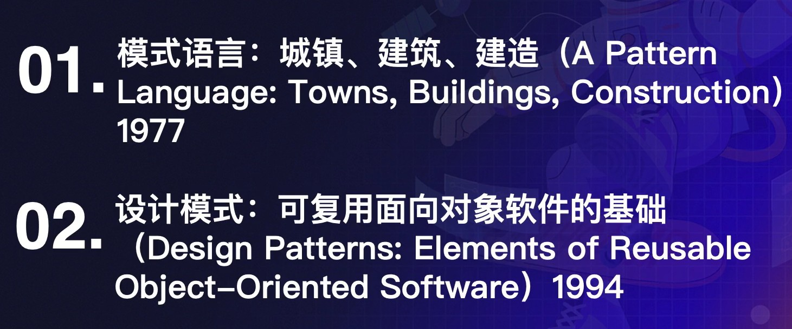
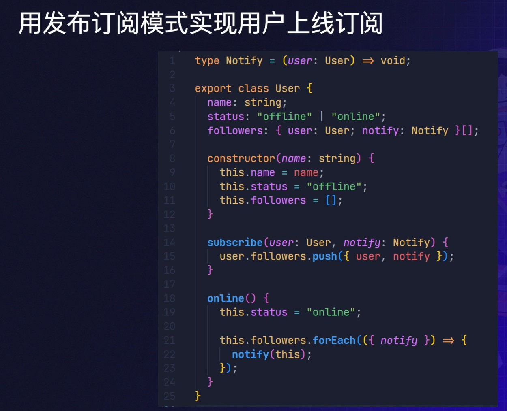
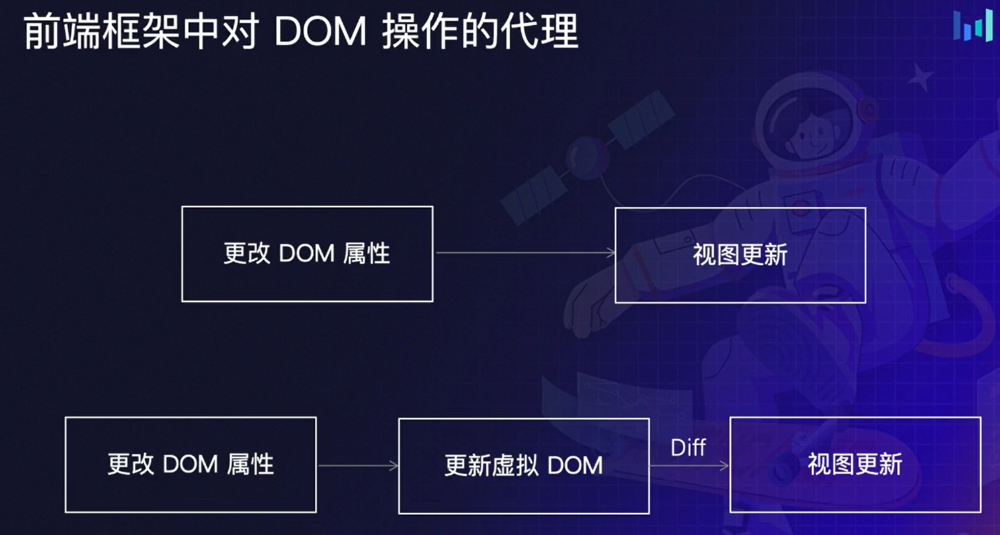
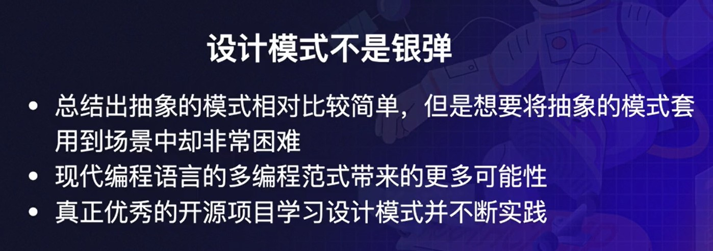

# 前端设计模式

`定义`
软件设计中常见问题的解决方案模型
- 历史经验总结
- 与特定语言无关(实现方法/思路)

### 设计模式一般分为三种类型:
- `创建型` 如何创建一个对象
- `结构型` 如何灵活的将对象组装成较大的结构
- `行为型` 负责对象间的高效通信和职责划分

## 23种设计模式

- [单例模式](#单例模式)
- [策略模式](#策略模式)
- [发布订阅模式](#发布订阅模式)
- [原型模式](#原型模式)
- [代理模式](#代理模式)
- [迭代器模式](#迭代器模式)
- [装饰器模式](#装饰器模式)
- ...

### 单例模式
`定义` 
全局唯一访问对象,
无论调用几次，组件也只实例化一次，最终获取的都是同一个实例。

`应用场景` 
缓存，全局状态管理等。

### 策略模式
`定义`
定义一系列的算法，把它们一个个封装起来，并且使它们可以相互替换。
`应用场景:`
策略模式是开发中最常用的设计模式，在一些场景下如果存在大量的 if/else，且每个分支点的功能独立，这时候就可以考虑使用策略模式来优化。

### 发布订阅模式
又称`观察者模式`
`定义`
一种订阅机制，可在被订阅对象发生变化时通知所有订阅者。
`应用场景`
用于解决对象间的解耦，到业务中一些实现模式，像邮件订阅，上线订阅等等，应用广泛。

### 原型模式
`定义`
复制已有对象来创建新的对象
`应用场景`
JS中对象创建的基本模式

### 代理模式
`定义`
可自定义控制对原对象的访问方式，并且允许在更新前后做一些额外处理
`应用场景`
监控，代理工具，前端框架实现等等

`单一职责原则`
一个方法或者一个类尽量只做一件事情

### 迭代器模式
`定义`
在不暴露数据类型的情况下访问集合中的数据
`应用场景`
数据结构中有多种数据类型，列表，树等，提供通
用操作接口

### 装饰器模式
`定义`
动态地为某个对象添加一些额外的职责，而不会影响对象本身。
`应用场景`
装饰器模式在开发中也是很常用的设计模式，它能够在不影响源代码的情况下，很方便的扩展属性和方法。比如以下应用场景是提交表单。

---

## 框架中的设计模式
### 代理模式
`定义`
可自定义控制对原对象的访问方式，并且允许在更新前后做一些额外处理
`应用场景`
监控，代理工具，前端框架实现等等

### 组合模式
`定义`
可多个对象组合使用，可也单个对象独立使用
`应用场景`
DOM,前端组件，文件目录，部门

